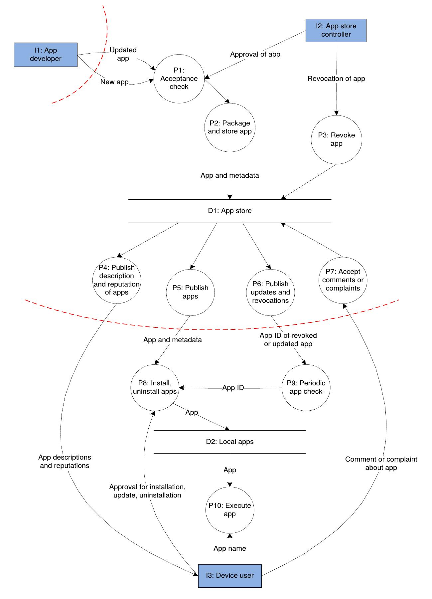
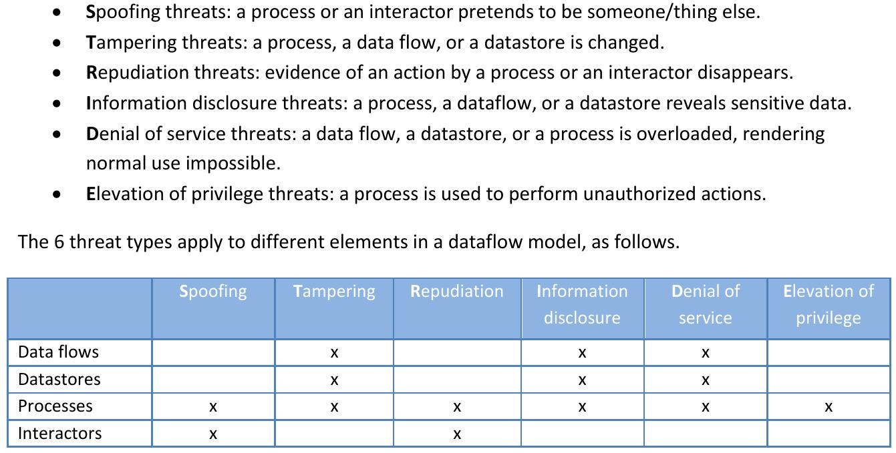
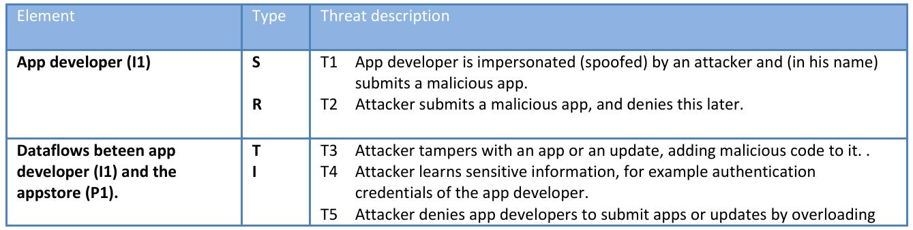
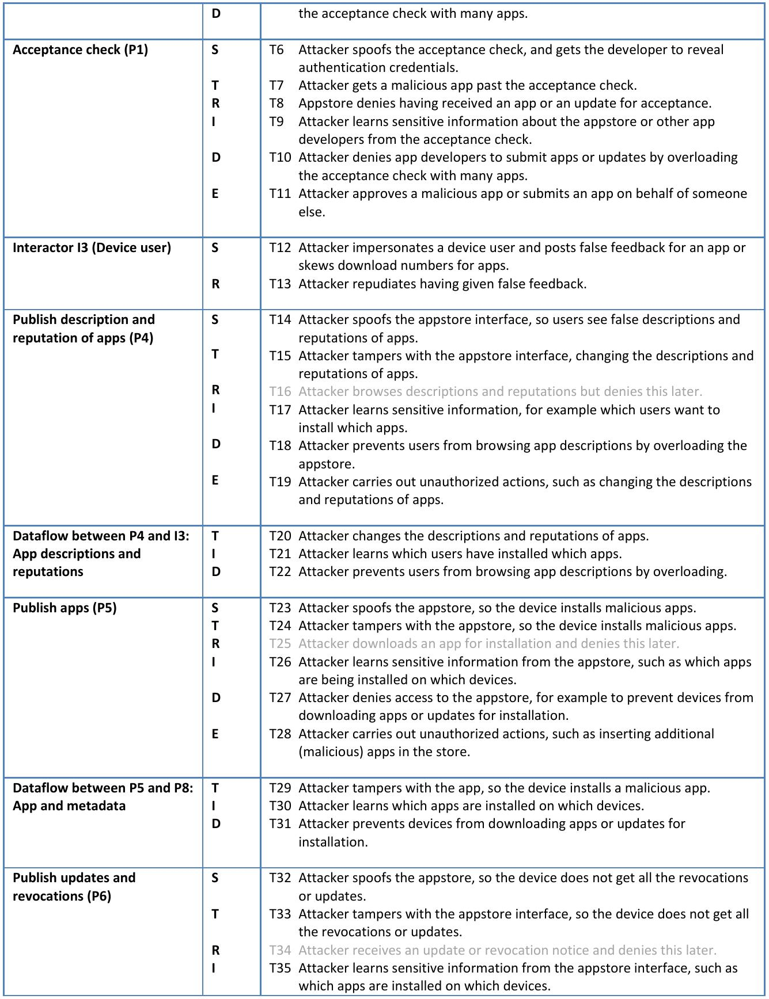
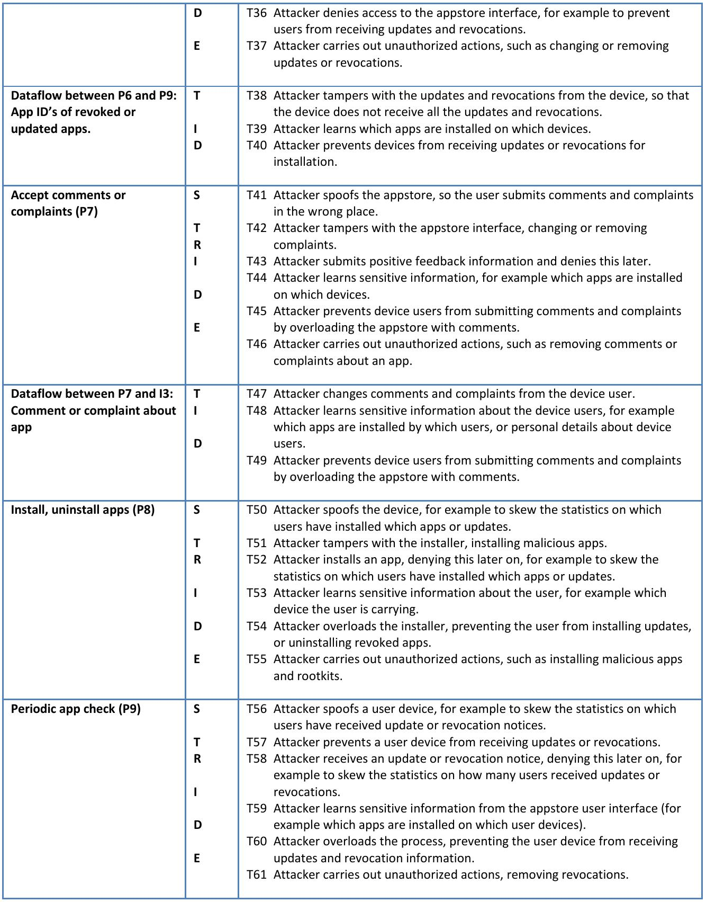
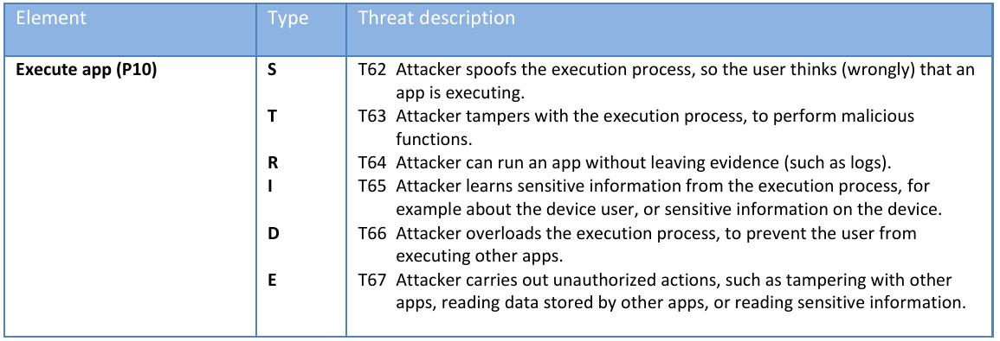
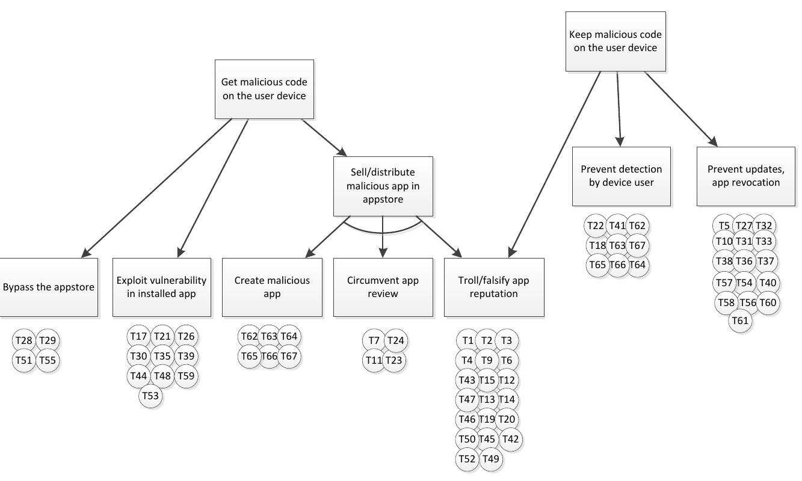
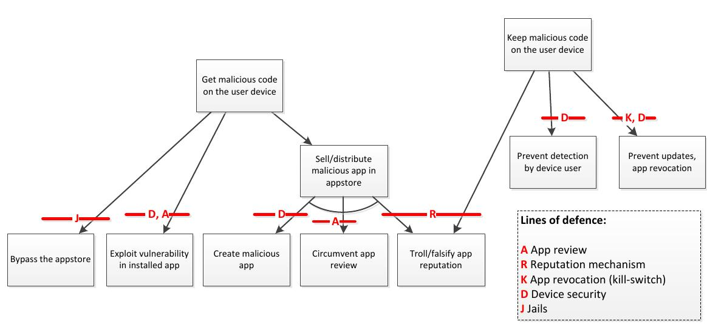

=================================
Summary Appstore security (ENISA)
=================================

:ENISA: European Network and Information Security Agency

Executive Summary
=================

* Es gibt mehr Smartphones als PC's
* Smartphones beziehen Applikationen von AppStores (Zentrales Repository)
* Apps erweitern das Telefon um kleine und Grosse Funktionalität (Analog Desktop) und können daher ein Sicherheitsrisiko darstellen
* Trotz Sichtung der Apps im Appstore befindet sicher immer wieder Malware in Apps

Begriffe
--------

App review
	* AppStores sollten Apps einer Überprüfung unterziehen
	* Reviews sind nicht perfekt

Reputation mechanism 
	* Bewertungen, Kommenare
	
App revoke
	* Remote uninstall von Apps durch den App Store Anbieter
	
Device Security
	* Geräte sollten Apps in Sandboxes ausführen
	
Jails
	* Plattformanbieter können Geräte auf bestimmte AppStores einschränken um Drive-By-Downloads zu verhindern.
	
	
Conclusion
----------

* In conclusion, on the positive side, appstores can offer important opportunities to prevent, or reduce the impact, of malware and insecure apps. 
* Gleichzeitig fokusieren sich Cyber Attacken immer mehr auf Smartphones
* Endkunden, Regierungs- und Firmenangestellte speichern immer mehr vertrauliche Dokumente auf Smartphones
* Unterschiedliche Plattformen verwenden unterschiedliche Mechanismen, um verseuchte Apps zu kennzeichnen und zurückzuziehen -> Kann Kunde verwirren

Einleitung
==========

* Es gibt viele verschiedene Appstores, nicht nur für Mobile Devices sondern auch für andere Geräte sowie für Software (Amazone Marketplace, Facebook Apps, Business Cloud Apps, ...)

Dataflow diagramm of an app ecosystem
=====================================

Attacker model
==============

Attacker Ziele
	1) malicious code auf dem Device ausführen
	2) malicious auf dem Gerät behalten (falls 1 erfolgreich)
	
Angriffskategorien
	1) Sell or distribute a malicious app.
	2) Exploit vulnerability in an existing app.
	3) Sell or distribute a malicious OS
		* Betrifft nur Custom ROM
	4) Exploit vulnerability in an existing OS
	

	
Thread analysis
===============

on the trust boundaries
-----------------------

inside the trust boundaries
---------------------------

Defending against the threats
=============================

App Review (A)
--------------

* Nicht 100%ige Sicherheit

Automatische analyse tools 
	* Statische Binary-Analyse
	* Check auf nicht erlaubte Funktionsaufrufe 
	* Guidelines check
	* Scan nach bekannten Malware Mustern
	
Manual analysis
	* human check
	* z.B. Auffinden von Spoofing
	* Skalierbarkeit problematisch
	* Fokusierung auf kritische Funktionalität kann manuelle Analysen effizienter gestalten

Sharing analysis results
	* Appstore Anbieter sollten untereinander Analysedaten austauschen
	
Authentication of app developers
	* Viele kleine Entwickler (z.T. mit mangelhaftem Wissen und Tools)
	* Entwickler von Malware sollten identifiziert und nicht erneut als Developer zugelassen werden
	
Risk profiling of app developers
	* Appstores sollten Risiko Profile erstellen
	
Continious process
	* Apps müssen auch geprüft werden, nachdem sie zum Store zugelassen wurden (z.B. periodisch nach Bekanntheit, Reputations, ...)
	
Priority for Updates
	* Apps und Store updates
	
	
Reputation mechanism (R)
------------------------

* keine 100%ige Sicherheit

App track record
	* History und track record einer App sollten ersichtlich sein
	* Download Statistiken
	* Votes
	* Kommentare
	
Separate security and privacy reputation
	* App Bewertung sollte einzeln für Funktionalität, Privacy und Security abgegeben werden können
	
Sybil attack resitance
	* Verhindern, das Angreifer sich mehrere Pseudonymidentitäten anlegen können
	* Alle Bewertungen zu allen Apps von Entwickler sollten in seinem Profil zusammenfliessen
	
Second-order reputation
	* Benutzerbewertungen von Benutzern, die viele Bewertungen abgeben, sollten höher gewichtet werden
	
Anonymous feedback
	* Feedback von Usern muss anonymisiert werden, Informationen über ihr Gerät darf im public Feedback nicht sichtbar sein
	* Ansonsten kann ein Angreifer über die Bewertungen herausfinden, was für Apps ein User installiert hat
	
Exchanging reputation information
	* Appstores sollten Reputations zur gleichen App Appstoreübergreifend austauschen
	
Permission feedback
	* Benutzer sollten einzeln Feedback über Sicherheitsrelevate Features sowie excessiven Rechteanforderungen (z.B. Kontaktzugriff für ein Snake Game) geben können
	
	
App revocation
--------------

* Uninstallation von verseuchten Apps kann entweder vom Geräteanbieter oder vom Appstoreanbieter gemacht werden

User communicaton and consent
	* Benutzer informieren über die Gründe
	* Opt-Out anbieten
	* App revocation kann gegen Security Policies verstossen (z.B. Milität: Apps sind Mission-critical) und sollte ausschaltbar sein
	
Spawning
	* Verhindern, dass Apps sich einfach installieren und schwierig deinstallieren lassen
	* Verhindern, das App bei der Installation Code an Stelle ablegt, an die der Uninstallmechanismus nicht kommt (z.B: ausserhalb Sandbox)
	* Uninstall sollte alle Änderungen rückgängig machen, die die App verursacht hat
	
Update frequency
	* Benutzer dazu anhalten, regelmässig updates zu machen
	
Detection
	* Reputation mechanismen sind die Grundlage für revokation, daher sollten Kommentare und Bewertungen gesichtet werden.
	
False positive
	* Revocation kann zur Deinstallation von guten Apps führen und sollte daher nur dem Security Team zugänglich sein

Device Security (D)
-------------------

Code signing
	* Geräte sollten nur signierten Code zulassen
	
Sandboxes
	* Alle Apps sollten in Sandboxes isoliert ausgeführt werden
	
Minimal set of priviledges
	* Apps sollten innerhalb der Sandbox nur die Privilegien besitzen, die sie wirklich brauchen
	* Apps sollten nachfragen müssen für bestimmte Privilegien (z.B. GPS)

Monitoring by the smartphone user
	* Das gerät sollte die Apps überwachen und dem User reports anzeigen
	
Clean slating
	* Bei Uninstall (durch User oder Store revocation) sollte das Gerät anschliessend im pre-installed Zustand sein (Keine Resten der App auf dem Device)
	

Jails or walled gardens (J)
---------------------------

* User auf vertrauenswürdige Appstores einschränken oder bestimmte verbieten
* Warnungen oder Einschränkungen sollten nicht einfach weggeklickt werden können -> Drive by infection
* Zu starke Restriktionen fördern Jailbreaks

Closed app ecosystem
	* Benutzer kann nur von vordefinierten Stores Apps installieren

Enterprise app stores
	* Ermöglicht Firmen, ihre Geräte besser zu kontrollieren (Apps nur erlaubt vom eigenen Store)
	
Open app ecosystem
	* Jeder kann einen Store eröffnen
	* Maximale Freiheit für Nutzer
	* Erhöht das Risiko von Drive-by-Download attack
	
Federated appstores
	* Apps müssen ein minimum Level an Security erfüllen

App reputation across appstores
	* Zentrale List von "well-reputated" apps / app whitelist

