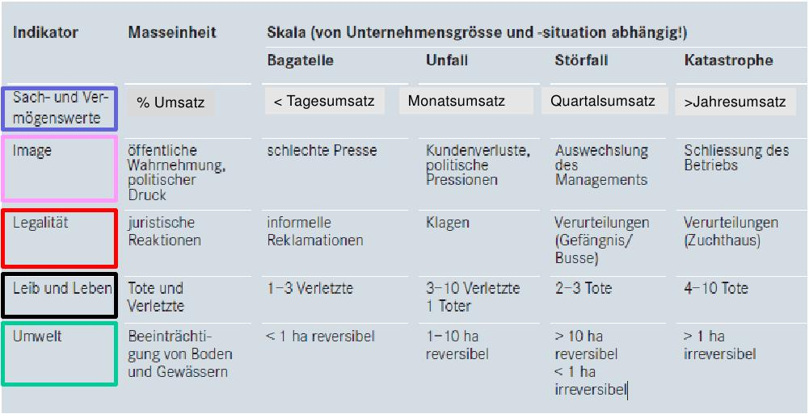
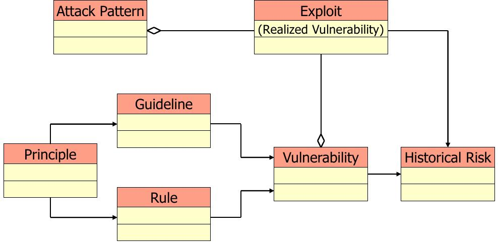
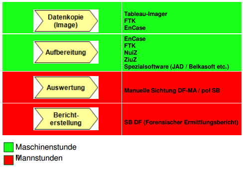

=======================================
FS14 InfSi3 Repetitionsfragen Antworten
=======================================

Dieses Dokument wird vorzu erweitert. Ergänzungen und Antworten sind herzlich willkommen.
Repetitionsfragen: https://github.com/moonline/HSR.modules.InfSi3/blob/master/RepetitionQuestions.rst

.. contents:: Inhaltsverzeichnis

1 Information Security Management
=================================

**1.0.1. Thread Model**

.. image:: img/rq-1.0.1.1.jpg
   :width: 50 %

**1.0.2. Effiziente Massnahmen**

Mit organisatorischen Massnahmen (M2 Organisationsmanagement).

**1.0.3. Risikomodell**

::

	Risiko = Schaden ◆ Eintrittswahrscheinlichkeit
	       = Schaden ◆ Bedrohung ◆ Verletzlichkeit der Schutzmassnahmen
	
	Es muss eine Bedrohung existieren, damit ein Risiko da ist!

.. image:: img/rq-1.0.3.1.jpg
   :width: 50 %

**1.0.4. Grund für Sicherheitsmassnahmen**

Unternehmen fürchten sich vor Gesetzesverstössen

1.1 Anforderungen an Informationssicherheit
-------------------------------------------

**1.1.1 Schadensindikatoren**

   Der Indikator gibt an, um was für einen Schaden es sich handelt. Die Skala definiert, in welcher Grössenordnung Bagatellen, Unfälle, Störfälle und Katastrophen für die jeweiligen Schäden liegen.

**1.1.2. Gesetzliche Anforderungen**

* Datenschutz (Bearbeiten von Personendaten)
* Vorschriften für Finanzinstitute
* Fernmeldegesetz
* Allgemeines Controlling

**1.1.3. Gesetze & Artikel**

DSG
	Datenschutzgesetz, regelt Bearbeitung von Personendaten, Schutz von Systemen gegen bestimmte Risiken
Stgb Art. 179
	Vorsätzlicher Missbrauch von Fernmeldeanlagen, Unbefugtes Beschaffen von Personendaten
HIPAA / TARMED
	Schutz von Gesundheitdaten
BankG Art 47
	Bankgeheimnis, Umgang mit Finanzdaten / Kundendaten
VSB 08
	Vereinbarung zwischen den Bankiervereinigung und Banken über Sorgfaltspflicht
PCI
	Payment Card Industry Data Security Standard Anforderungen, Schutz von Daten und Hardware
Fernmeldegesetz
	Regelt Telekommunikationsdienstleistungen sowie den Schutz übertragener Daten
SOX
	Allgemeines Controlling für US-börsenkotierte Unternehmen
FISA 1978
	Regelt Vorgehen bei Aufklärung und Spionageabwehr un den USA
PATRICOT ACT 2001
	Anti Terror Bestimungen zur vereinfachten Überwachung von Bürgern

1.2 Threads
-----------

**1.2.1. Bedrohung, Motivation, Mittel**

Die Bedrohung steigt sowohl mit zunehmender Motivation und zunehmenden Mitteln (Zeit/Finanzen) und den technischen Fähigkeiten.

Jedermann
	Ausprobieren, wenig Know How, Schaden gering, geringe Motivation
IT-Freak
	Persönliche Profilierung, gutes Know How, Schaden gering
Professioneller Hacker / Hacktivismus
	Gezielte Angriffe, gutes Know How, persönlicher oder politischer Gewinn
Spione
	Gezielte, mit viel Mitteln gestützte Angriffe, grosses Know How, Nationale Interesse, Schaden gross
	

**1.2.2. NSA**

* Nationale Sicherheitsagentur mit weltweiten Standorten
* Verarbeitet und überwacht riesige Datenmengen
* 30'000 MA / 8Mia Jahresbudget

**1.2.3. Quantum**

Computer werden hardware oder Softwareseitig infiziert und anschliessend Daten zur NSA umgeleitet.
Z.B. Leitet die NSA Trafic an Internet Routern um, um sich in ein login einzuhängen und das Target zu kompromitieren.

2 Location Based Services
=========================

**2.0.1. Typen von LSB**

Map/Navigation
	* Standort
	* Bewegung
Local Information/Search
	* Standort
	* User generated content
Tracker
	* Standort
	* Bewegung
Special (Friend finder, Augmented Reality, Gaming, ...)
	* Standort

**2.0.2. Standort bezogene Dienste (Beispiele)**

* Google Maps -> Aktuelle Position, ermittelt über IP, GPS, Wlan, Mobilfunk
* Trafic Info -> Aktuelle Position/Verkehrsweg
* Wetter App -> Aktuelle Position
* SBB Fahrplan (indirekt)
* Google Now
* Google Buzz (Around Me)
* Google Glass

**2.0.3. Datenschutzgesetz**

DSG Art3 Begriffe
	Personendaten
		Daten, die sich auf eine Person beziehen
	Besonders Schützenswerte Personendaten
		* Religiöse/politische Ausrichtung
		* Gesundheitsdaten
		* Soziale Hilfe
		* Strafverfolgung
	Persönlichkeitsprofil
		Erlaubt die Beurteilung der Persönlichkeit
DSG Art4 Grundsätze
	Bearbeiten von Personendaten
		Nur für vorgesehen Zweck verwenden
	Beschaffung von PD
		Zweck und Zweck ihrer Bearbeitung muss ersichtlich sein
	Einwilligung zur Bearbeitung
		* Betroffener muss angemessen Informiert werden
		* ausdrückliche Einwilligung für besonders Schützenswerte Daten
DSG Art5 Datensicherheit
	Personendaten müssen angemessen (organisatorisch/technisch) geschützt werden
DSG Art6 Auskunfstrecht
	Betroffene haben das Recht auf Auskunft über die Bearbeitung ihrer Daten
DSG Art14 Tracking/Persönlichkeitsprofile
	* Betroffene Person muss informiert werden
	* Angegeben werden müssen: 
		* Inhaber der Datensammlung
		* Zweck
		* Kategorien der Empfänger bei Datenweitergabe
		
**2.0.4. Google Analytics/Facebook Social Buttons auf Webseiten**

a) Gesammelte Informationen
	Google
		* Aufrufzeitpunkt, Dauer des Besuches jeder Seite
		* Ungefährer Standort, Land, Region, Ort, Provider, Down-/Uploadrate
		* Betriebsystem, Sprache, eingestellte Lokalisierung, Bildschirmauflösung, Gerätetyp
		* Browser Footprint, Unterstützte Plugins/API's
		* Neuer Benutzer oder wiederkehrender
	Facebook
		* Selbe Informationen wie Google Analytics +/-
		* Identität (z.B: Facebook login)
		* Mit Identität verknüpfte Informationen (Freunde, Familie, Vorlieben)
		* Was dem Benutzer gefällt oder nicht (Like)
	Anwaltskanzlei
		* Selbe Informationen wie Google Analytics
		
b) Zu Beachten
	* Facebook verfügt über Persönlichkeitsprofile der Benutzer -> DSG Art.14
	* Die Anwaltskanzlei muss in der Lage sein, Benutzern Auskunft darüber zu geben, welche Daten gesammelt wurden
	
	
2.1 Methoden zur Lokalisierung von Objekten
-------------------------------------------

**2.1.1. Passive Standortpreisgabe Beispiele**

* Online Fahrplan
* Google Maps
* Navi
* Wetter Apps

**2.1.2. Standortbekanntgabe bei Browsern**

Der Browser schickt alles, was er hat:

* Sichtbare WLAN Netzwerke
* IP

**2.1.3. Lokationsdaten**

Lokationsdaten, die mit einer Person verknüpft sind (auch IP Adressen) sind in CH Personendaten.

**2.1.4. IP Lokalisierung**

Über IP wird zugeteilter Provider ermittelt -> Zugangsknoten von ISP ist genauste mögliche Location.

**2.1.5. IP Adresse als Personendatum**

Da die IP mit der Identität eines Benutzers verknüpft ist sie das und unterliegt damit dem DSG.

**2.1.6. Cell Tower Localization**

* Provider weiss, in welcher Zelle sich ein Benutzer befindet
* Handy sieht jedoch mehrere Antennen und kann über einen Antennenstandortdatenbank mittels Triangulation ziemlich genau seine Position orten

**2.1.7. GSM Netz**

Ein Mobiltelefon gibt folgende Daten in einem GSM Netz preis:

* Identität, TeilnehmeriID+Verschlüsselungskeys auf SIM (GSM besitzt eine Authentisierung)
* Zelle (Standort auf weniger als eine Zelle genau da mit den Signallaufzeiten gearbeitet wird)
	* Location Area ID
	* Cell ID
	* Timing Advance
* Die weltweit eindeutige TeilnehmeriID wird auf der Luftschnittstelle verborgen und stattdessen eine temporäre verwendet, um Mithörer diese nicht preiszugeben

**2.1.8. Wlan Ortung**

* Nutzer gibt seine Mac Adresse Preis (Weltweit eindeutig)
* Ortung erfolgt über WLAN Datenbanken

**2.1.9. Beacons**

* Kurz- und Langdistanz RFID/Bluetooth Tags Zur Identifikation von Fahrzeugen (langdistanz) oder Personen in Gebäuden (Kurzdistanz)
* Smartphones verbinden sich mit Beacons an Messen

**2.1.10. E-Plate Long Range Tags**

Aktive RFID Tags in Kennzeichen, auslesbar auch 100m Entfernung und bis 320 Km/h

**2.1.11. Genauigkeit der Lokalisierung**

* Bluetooth/Beacons Kurzdistanz: Bis 2m
* GPS: Bis 15m, mit Korrekturdaten bis im cm Bereich

**2.1.12. GSP zur Flottenüberwachung**

Der Arbeitgeber überwacht damit den Mitarbeiter und trackt diesen Kontinuierlich. Der MA muss darüber informiert werden und sein Einverständnis geben.

**2.1.13. bewusste Bekanntgabe von Lokationsdaten**

Der Benutzer tätigt eine Handlung, mit der er seine Position bekannt gibt. Z.B:

* Hochladen eines Bildes mit GPS Daten
* Friends Finder (Standort Sharen)
* Facebook Places (An einem Ort "einchecken")
* Flicker Foto Upload: Standort auf Karte einzeichnen

**2.1.14. unbewusste Bekanntgabe von Lokationsdaten**

Die Bekanntgabe des Standortes ist ein Nebeneffekt eines genutzten Dienstes, z.B.:

* Wetter Apps
* Activity Tracker
* Google Suche (Browser Footprint, IP)
* CDN Abrufe
* Proxy

**2.1.15. Google**

Google hat ziemliche Umfangreiche Informationen über Benutzer, da sie auf sehr vielen Webseiten mit Google Analytics drinhangen und sehr viele Dienst betreiben, auf denen User breitwillig Informationenpreisgeben:

* Surfverhalten / Vorlieben (Suche)
* Freunde / Familie (Google+)
* Standort (Google Maps, Google Buzz, Google Glass, Autonome Fahrzeuge)
* Reisen (Flugvergleiche, Fahrpläne)
* Informationen über benutzes Gerät sowie online-Zeiten (Schalfverhalten)

**2.1.16. Browser Fingerprint**

* Browser / Device / BS / Auflösung / Sprache / Lokalisierung
* Standort / ISP
* Unterstützte JS Schnittstellen / Aktivierte Plugins / Addons / Media Support
* Browsereinstellungen wie "Do Not Track" / JS ein/aus / Cookie settings
* Local Storage / Flash Storage

Die Kombination dieser Merkmale ist einmahlig und damit der Benutzer eindeutig zuortbar/idenitifizierbar.

**2.1.17. AGPS**

In AGPS, the Network Operator deploys an AGPS server. These AGPS servers download the orbital information from the satellite and store it in the database. Download speed for client is much faster of cellular network that from Satellite at 50 Bit/s it is also possible that Satellite goes out of sight and download needs to be started again.

**2.1.18. GPS Alternativen**

* Glonass: russisch, 24 Satelliten
* Galileo: Europäisch, bestehend aus 30 Satelliten 
* Beidou Navigation Satellite System: Chinesisch, begrenzt auf chinesisches Gebiet

**2.1.19. GPS Daten Korrektur**

Durch Basisstation (Standort ist berrechnet als const und auf Laufbahn). Liegt Satellite direkt über Basis Station kann eine Kalibration des Softwares stattfinden.

	
**2.1.20. Minimale Anzahl Satteliten für Triangulation**

* Mind. 3 (trigo..) je mehr desto präziser wird die Messung 
* Bei GPS sind immer vier sichtbar.

3 Software Security
===================

**3.0.1. Potentiell gefährliche Funktionen**

* Auffinden mit Blacklist (Tool)
* Massnahme gegen erneuten Fehler später: Tests

**3.0.2. Connectivity, Extensibility, Complexity**

Connectivity
	Jede Software ist mittlerweile über das Netz verbunden und somit einem grossen Angriffsrisiko ausgesetzt -> müsste sich entsprechend verteidigen
Extensibility
	Software selbst ist ausgereift und sicher aber Erweiterungen bringen wieder Schwachstellen ein
Complexity
	Zunehmende Komplexität erhöht die Fehlerwahrscheinlichkeit und somit die Wahrscheinlichkeit, das ein Security Problem vorliegt.
	

**3.0.3. Bugs, Flaws, Defects**

Bugs
	* Fehler im Code (Falschbenutzung von Schnittstellen)
	* Implementation Level Fehler
	* Maschinell auffindbar
	* z.B. Buffer Overflow, Race Condition, Unsave system call
Flaws
	* Falscher Programmfluss, Nicht behandeln von Spezialfällen
	* Design Level Fehler
	* Mit Code Analyse Tools nicht auffindbar
	* z.B: Method Overriding, error handling, type save confusion
Defect
	Überbegriff für Bugs und Flaws
	

**3.0.4. Bug oder Flaw?**

1) Rückgabewert von Read() ignored
   -> Bug
2) Verwendung von strlen() auf einem Wert, der nicht garantiert mit einem 0-Byte terminiert
   -> Bug
3) Speicherung von Benutzerpasswörtern als Klartext in der Datenbank
   -> Flaw
4) Passwort des Users mit memcmp mit Passwort in der DB vergleichen. Wenn der Rückgabewert von memcmp != 0 wird der Zugriff geblockt (memcamp("", password) gibt auch 0 zurück).
   -> Bug (Ja nach Definition könnte es auch ein Flaw sein)

**3.0.5. Software Security Basics**

* Risk management
	* Business and technical risk
	* Risk priorisation
	* Mitigation strategies
* Best practices
	* Code Review
	* Risk analysis
	* Penetration testing
* Knowledge
	* Prescriptive Knowledge(Principles/Guidelines)
	* Diagnostics (Vulnerabilitis, Exploits, Attacks)
	* Historical risks
	
	
**3.0.6. Risiko**

Setzt sich zusammen aus Schaden (Schadensausmass) und Eintrittswahrscheinlichkeit (Verletzlichkeiten, Bedrohung)

.. image:: img/rq-1.0.3.1.jpg
   :width: 50 %

Es sollte so viel Geld in Security investiert werden, das die Gesammtkosten (Schaden + Massnahmen) minimal sind.

**3.0.7a. Best Practises**

1) Code Review
2) Risiko Analysen
3) Penetration Testing

**3.0.7b. Massnahmen & Artefakte**

i) Requirements & Use Cases
	* 7 Abuse Cases
	* 4 Security Requirements
	* 3 Risk Analysis
ii) Architecture & Design
	* 3 Risk Analysis
iii) Test Plans
	* 6 Risk based Security Testing
iv) Code
	* 2 Code Reviews
v) Tests & Test Results
	* 5 Penetration testing
	* 3 Risk Analysis
vi) Feedback from the Field
	* 5 Penetration testing
	* 1 Security Operation
	
	
**3.0.8. Barry Boehms Cost of Change Law**

Mit jeder Phase im SW-Entstehungsprozess steigen die Kosten, wobei sie exponentiell steigen.
Bugs, die während der Entwicklung gefunden werden, sind um Faktoren günstiger, als Bugs, die beim Kunden gefixt werdne müssen.

**3.0.9. Software Security Knowledge**

* Prescriptive Knowledge
	* Principles
	* Guidelines
	* Rules
* Diagnostic Knowledge
	* Vulnerabilitis
	* Attacks
	* Exploits
* Historical Knowledge
	* Historical risks
	

**3.0.10. Security Knowledge Architecture**

   Exploits sind erkannte Verletzlichkeiten. Aus diesen ergeben sich Angriffsmuster und Historische Risikodaten. Zum Verhindern von Verletzlichkeiten kommen Prinzipien (Guidelines, Rules) zum Einsatz.

**3.0.11 Code Review Tools**

1) Code Scanners: Scannen den Code nach Patterns (Regex)
2) Advanced Source Code Analysis Tools: Führen den Code aus und analysieren den Code Fluss. Diese finden auch falsch Verwendete Schnittstellen etc. die nicht auf den ersten Blick ersichtlich sind.

**3.0.12. Architectural Risk Analysis**

* Analyse über die Attenresistenz (Checklisten zum Finden von bekannten Problemen)
* Mehrdeutigkeitsanalyse (Unklarheiten in den Architekturdokumentationen)
* Schwächenanalyse (Analyse von Abhängigkeiten von externen Tools und Frameworks und dadurch entstehende Schwächen)

4 Microsoft Security Livecylce
==============================

**4.0.1. Continious Process Improvement & Accountability**

Continious Process Improvement
	* Ständiger Verbesserungsprozess des Security Livecylce
		* Vier Levels: Basic, Standardized, Advanced, Dynamic
	* Disciplines (In jeder Discipline wird Kontinuierlich versucht, ein höheres Level zu erreichen)
		* Schulungen, Policy, organisatorische Fähigkeiten
		* Anforderungen & Design
		* Implementierung
		* Verifizierung
		* Release & Response
Accountability
	* Definierte Verantwortlichkeiten für den Fall eines Vorfalls
	* Wenn was passiert, schnell rausfinden, was passiert ist (Release and Response)
	* Zugriff für alle Beteiligten (Public Repo)
	* Im Falle eines Vorfalles soll schnell und richtig reagiert werden
	
	
**4.0.2. Security Livecylce**

::

	.-------------------+-------------------------------------------------------------.
	| 1) Training       | Core Security training                                      |
	'---------------------------------------v-----------------------------------------'
	.-------------------+-------------------------------------------------------------.
	| 2) Requirements   | * Establish Security Requirements                           |
	|                   | '-> Experten einbeziehen                                    |
	|                   | * Create Quality gates / Bug bars                           |
	|                   | '-> Produkt erst freigeben, wenn Bug/w Rate unterschritten  |
	|                   | * Security & Privacy Risk Assessment (R. minimieren/tragen) |
	'---------------------------------------v-----------------------------------------'
	.-------------------+-------------------------------------------------------------.
	| 3) Design         | * Establish Design Requirements                             |
	|                   | * Analyse Attack Surface                                    |
	|                   | '-> z.B. einhalten von "Least Priviledge"                   |
	|                   | * Threat Modelling                                          |
	|                   | '-> Checklisten/Regeln (z.B. BSI Handbuch)                  |
	'---------------------------------------v-----------------------------------------'
	.-------------------+-------------------------------------------------------------.
	| 4) Implementation | * Use Aprooved Tools (z.B. Code analysis tools)             |
	|                   | * Deprecate Unsafe Functions                                |
	|                   | * Static Analysis (Bugs finden)                             |
	'---------------------------------------v-----------------------------------------'
	.-------------------+-------------------------------------------------------------.
	| 5) Verification   | * Dynamic Analysis                                          |
	|                   | '-> Flaws finden, korrekte Implementierung überprüfen       |
	|                   | * Fuzzy Testing (Mit randoom input fluten)                  |
	|                   | * Attack Surface Review                                     |
	'---------------------------------------v-----------------------------------------'
	.-------------------+-------------------------------------------------------------.
	| 6) Release        | * Incident Response Plan                                    |
	|                   | * Final Security Review                                     |
	|                   | * Release Archive                                           |
	'---------------------------------------v-----------------------------------------'
	.-------------------+-------------------------------------------------------------.
	| 7) Response       | Execute Incident Response Plan                              |
	|                   | '-> Verfügbarkeit von Personen für Ernstfall                |
	'---------------------------------------------------------------------------------'

**4.0.3. Begriffe**

Quality gates / bug bars
	Gefundene Bugs/Woche muss best. Rate unterschreiten, damit das Release freigegeben wird
Risk Assessment
	Risiken minimieren, kleine Risiken tragen
Analyse Attack Surface
	Angriffsmöglichkeiten untersuchen, einhalten von Regeln wie z.B. "Least Priviledge"
Threat Modelling
	Mit Checklisten/Regeln Angriffsmöglichkeiten untersuchen (z.B. BSI Handbuch)
Fuzzy Testing
	Fluten mit Randoom Input
Dynamic Analysis
	Verhalten analysieren, macht das Programm, was es soll
Static Analyis
	Bugs finden
Response Plan
	Verantwirtlichkeiten, Verfügbarkeiten von Personen für Ernstfall
	

	
5 Web Application Security
==========================

**5.0.1. Web Applications**

* Über das Netz erreichbare Services (Zugriff von überall)
* Meisst Client/Server Architektur, Multi Tier Architektur
* Universellen Client (Browser), der nicht kontrolliert werden kann
* Direkter Zugriff zu Backend Data

**5.0.2. Web Application Architecture**

::

	.----------------------------------------------------------.
	|                          Client                          |
	'----------------------------------------------------------'
	                             ^ |
	                             | | Internet
	                             | |
	.----------------------------------------------------------.
	|              Server Network / Company Network            |
	|                            | |                           |
	|                            | v                           |
	| .------------------------------------------------------. |
	| |              Router, Firewall, Switching             | |
	| '------------------------------------------------------' |
	|                            ^ |                           |
	|                            | v                           |
	| .----------------..------------------..----------------. |
	| |                ||    Web Servers   ||                | |
	| '----------------''------------------''----------------' |
	|                             |                            |
	| .------------------------------------------------------. |
	| |                Web Application Server                | |
	| '------------------------------------------------------' |
	|          .------------------'------------------.         |
	| .---------------. .------------------. .---------------. |
	| |               |-| Database Servers |-|               | |
	| '---------------' '------------------' '---------------' |
	'----------------------------------------------------------'

**5.0.3. Cookies**

* Textdateien, die im Browser abgelegt werden (Speicherung von Requestübergreifender Information Clientseitig)
* Nur Scripts der Domain, die das Cookie gesetzt haben, dürfen es auch wieder lesen

.. code-block:: HTTP

	// scheme ame=value; name2=value2
	Cookie: LSID=DQAAAK…Eaem_vYg; Path=/accounts; Expires=Wed, 13 Jan 2021 22:23:01 GMT; Secure; HttpOnly; Domain=hsr.ch;
	
	
**5.0.4. Session Management**

1) Benutzer verbindet sich mit Server, loggt sich ein falls nötig
2) Server erzeugt eindeutige, nicht erratbare Session ID
3) Server speichert Session zu ID bei sich ab und schickt Session ID an Client
4) Client sendet Session ID bei jedem Request wieder mit, sodass der Server weiss, wer er ist

::

	                   Client              Web Server           App Server           DB Server
	                  
	Application Session  |<---------------------------------------->|
	
	HTTP Session         |<------------------->|
	
	Internal Session                           |<------------------>|
	
	Db Session                                                      |<------------------>|
	
	TCP Session         |<------------------->|<------------------->|<------------------>|
	

**5.0.5. Arten von Cookies**

Session Cookie
	* Speichert Session ID
	* Nicht persistent (Browser Memory)
	* Keine "expire time"
Persistent Cookie
	* In File abgelegt
	* Expire time
Secure Cookie
	* Darf nur über SSL/TLS Verbindungen transportiert werden
3rd Party Cookie
	* Wurde nicht von der ursprünglichen Seite gesetzt
HTTP Only Cookie
	* Nur durch HTTP auslesbar (Nicht durch JS)

**Supercookie**

* z.B. Flash Cookies
* Schwieriger zu finden und entfernen, Cookie-Remove Mechanismen von Browser finden sie nicht
* Werden an unterschiedlichen Orten gespeichert, z.B. in einem durch ein Flash Plugin angelegten File
* Erweiterte Funktionen, wie z.B. reguläre Cookies reaktivieren/verlängern

**5.0.6. E-Tags**

* Information, ob sich Seite beim Browser im Cache befunden hatte (Caching Kontrolle)
* Kann als Seitencookie gentzt werden, da zu jeder aufgerufenen Seite eine eindeutige ID gespeichert wird

**5.0.7. Cookie read/write access**

* Same Origin Policy: Nur Scripts vom gleichen Ursprung dürfen ein Cookie lesen

**5.0.8. Same Origin Policy**

* Port+Host+Protocoll stimmen überrein
* IP =! URL
* ABER gleiche Domain mit unterschiedlichen IP's (mehrere Web-Server) = Same Origin

**5.0.9. 3rd Party Cookie Data Mining**

1) Geladene Seite bindet über Skript ein Werbebanner eines Werbeanbieters ein und übermittelt Info über Domain (Damit die Werbeanbieter den Zugriff einem Werbekunden zuordnen können)
	.. code-block:: HTML
	
		

* Stealer.php macht dann selber ein redirect zum refer. Benutzer merkt fast nichts.
* Möglich ist auch die Einbindung vom Images (1x1 transparent gif) und cookies als query anhängen. 

**6.3.3. Arten von XSS**
 
Stored
	* Wird in Applikation (DB, etc) gespeichert und gerendert
	* Forum, comments + messages
	* Profile (Signatur, Username)
	* Mail (HTML)
Reflected
	* Non Persistent
	* 404 - Pages, The Page  does not exist
	* Application Error Pages  not valid for this field
	* Search Pages
DOM injections
	* Wird Client-Seitig eingebunden durch dynamische JS anzweisung
	* Z.B. Sprachparameter in URL, Auslesen mit JS, erstellen vom <h1> Element

	
**6.3.4. Welche Massnahmen gegen XSS**
 
* #0 - Never Insert Untrusted Data Except in Allowed Locations
* #1 - HTML Escape Before Inserting Untrusted Data into HTML Element Content
* #2 - Attribute Escape Before Inserting Untrusted Data into HTML Common Attributes
* #3 - JavaScript Escape Before Inserting Untrusted Data into JavaScript Data Values
* #4 - CSS Escape And Strictly Validate Before Inserting Untrusted Data into HTML Style Property Values
* #5 - URL Escape Before Inserting Untrusted Data into HTML URL Parameter Values
* #6 - Sanitize HTML Markup with a Library Designed for the Job
* Bonus #1: Use HTTPOnly cookie flag
* Bonus #2: Implement Content Security Policy

7 Mobile Security
=================

**7.0.1. "Mobile Applications Plattform"**

**7.0.2.  OWASP im Threat Modelling Process**
 
Mobile Application Architecture 
	This area describes how the application is designed from device specific features used by the application, wireless transmission protocols, data transmission mediums, interaction with hardware components and other applications.
Mobile Data 
	What data does the application store and process? What is the business purpose of this data and what are the data workflows?
Threat Agent Identification 
	What are the threats to the mobile application and who are the threat agents. This area also outlines the process for defining what threats apply to the mobile application.
Methods of Attack 
	What are the most common attacks utilized by threat agents. This area defines these attacks so that controls can be developed to mitigate attacks.
Controls 
	What are the controls to prevent attacks? This is the last area to be defined only after previous areas have been completed by the development team.

**7.0.3. Beispiel Moves**

* Verwendung von Location Data + Accelerometer. Stellt die tägliche Aktivität da.
* Daten: Location (GPS, Wi-Fi), Accelerometer samples, places, Device data
* Speichern: everywhere and anywhere. Daten werden mit Plugins geteilt…
* Schutz?

**7.0.4. Angriffskanäle bei Smartphones**

* Social Engineering
* Drive-by Exploitation
* Phishing
* Network Services (Man-In-Middle WLAN)
* WebView
* Market Place / direct install
* Physical Attacks (USB Aufladeports in Hotels..)

**7.0.5. OWASP Risiken identifizieren**
 
1) Take the list of all sensitive data (or information to protect) listed in Section Mobile Data
2) Make a list of all the ways to access this data
3) Identify the attackers using the ways i.e. the medium to access sensitive data 

**7.0.6. Thread Agents Kategorien**

Human Interaction vs Automated Programs

**7.0.7. Angriffsszenarien bei einem Mobile Device**

* Local Memory / Storage based methods (“Method aimed to read the local application memory”)
* OS and application level methods
* Endpoints based methods (Webs Servise, Malware in app store, Cloud Storage)
* Communication Channel Based Methods (Wireless interfaces based methods)
* Miscellaneous Methods (GPS exploit, microphone recordings)

**7.0.8. Apps Rechte und Speicherzugriff**

* Apps werden grundsätzlich im User-Mode ausgeführt. Bei Rooted/jailbraked devices kann ein App auch in kernel-mode ausgeführt werden.
* Flash Memory, Internal Memory, SD

**7.0.9. Malware im App Store**

* Android: App wird gescannt nach bekannte Malware, User melden Probleme mit App
* iOS: Auch gescannt, manuell überprüft. (schwieriger)
* Angriff auf AppStore selbst

   Lines of Defense

**7.0.10. Angriffe Auf Kommunikationschannels**

* Man in the middle (MiTM) attacks which can steal data packets including SMS or voice packets
* Stealing data when its in-transit using wireless channel like 802.11, NFC based data exchange or Bluetooth based data exchange. Application Level Attacks
* Targeting malicious corporate network. (e.g. VPN Keys, etc)

**7.0.11. Flexispy und Probleme**

* Flexispy captures the content of emails, texts, call log details and GPS coordinates. Flexispy also gives customers the ability to listen to live calls. Customers are alerted that the mobile device with the software installed is on an active call. 

Problem
	* Kann beliebig eingesetzt werden. Verletzung Privatsphäre.
	* Device muss ge-Jailbreaked sein -> führt zu weitere Probleme, hebt Schutz auf.

**7.0.12. Sicherheitsprobleme im Smartphone Umfeld**

   PC-Welt

**7.0.13. Mobile Security Top 10 Listen**

ACHTUNG! Die Folien weisen eine andere Reihenfolge auf… Unten die aktuellste Reihenfolge nach Bedrohung 201X.

M1 - Weak Server Side Controls
	Alles was  nicht auf dem Phone stattfindet. z.B. SQL Injection auf Server-Side (OWASP Top 10)
M2 - Insecure Data Storage
	* Sensitive Data nicht verschlüsselt. OS spezifische Verschlüsselungsmöglichkeiten (Stores) nicht verwendet.
	* World readable Configs
M3 - Insufficient Transport Layer Protection
	Kein SSL, SSL Warnungen ignoriert, Cert Chain nicht bestätigt, schlechte Implementierung von SSL (iOS lässt grüssen)
M4 - Unintended Data Leakage
	Passwort in Log ausgegeben (clap, clap). Review third party libs.
M5 - Poor Authorization and Authentication
	Verwendung von DeviceID oder SubscriberID as einziger Auth-Methode.
M6 - Broken Cryptography
	Key mit Verschlüsselte Datei abspeichern bringt nichts. OS-Features verwenden
M7 - Client Side Injection
	Pure web apps (XSS). Phone Reset Aufruf via tel://resetcodehere# möglich!
M8 - Securty Decisions Via Untrusted Inputs
	App Aufrufe via eigene Handlers (z.B. skype:23487234?call) => Anruf wird direkt betätigt. Immer User nach eine Bestätigung Fragen von externe Quellen.
M9 - Improper Session Handling
	* Sessions leben länger auf dem Client. Absichern, dass ein Session revoke (echo to server, reponse denied, destroy session)
	* High entropy sources!
M10 - Lack of Binary Protections
	* Analysis byte-code. (API Keys, Passwörter, Sensitive Bussiness-Logik)
	* Keine God-Mode Code!

8 Smartphone Security
=====================

**8.0.1. Risiken eines kompromitierten Gerätes**

Privat
	* Konto Infos, Social Engineering
Business
	* Wirtschaftsspionage
	* Zugriff auf interne Netzwerk-Firma (call-home)

	
**8.0.2. Sicherheitsmechanismen Hardware**

Schlüsselspeicher (Keychain)
	* Sichere Ablage von «sensitiven» Informationen
	* Schutz gegen unberechtigten Zugriff auf dem Gerät, im Backup, usw.
Geräte-PIN
	* Schutz gegen interaktive Verwendung des Gerätes
	* Schutz gegen Zugriff über andere Schnittstellen
Speicherverschlüsselung
	* Schutz gegen physischen Zugriff auf den Speicher
	* Schutz gegen Zugriff mit modifiziertem Betriebssystem

**8.0.3. Sicherheitsmechanismen Betriebssystem**

Update-Funktionalität
	* Schnelle Aktualisierung  von Betriebssystem und Apps
Zugriffskontrolle auf OS-Stufe
	* Optimale Trennung von Anwendungen auf Betriebssystem-Stufe
	* Einsatz von Betriebssystem-Benutzern mit eingeschränkten Rechten
Integritätskontrolle auf OS-Stufe
	* Schutz gegen «Rooting» / «Jailbreaking»
	* Sicherstellen, dass alle Sicherheitsmechanismen intakt sind

**8.0.4. Sicherheitsmechanismen um Apps abzusichern**

Sandbox
	* Logische Trennung (Separierung) von Apps
	* Zugriffe auf Betriebssystem-Funktionen und Hardware einschränken
Integritätskontrolle Apps
	* Inhaltliche und technische Kontrolle der Apps im Store
	* Verwendung von digitalen Signaturen
Rechtesteuerung
	* Vergabe von Zusatzrechten durch Benutzer (z.B. Zugriff auf GPS, Internet)
Backup
	* Regelmässige Erstellung von Backups mit einfacher Restore Möglichkeit
	* Sichere Ablage der Backup-Daten

**8.0.5.  iOS und Android Daten Verschlüsselung**

iOS
	* Keychain in SQLitte Datenbank abgelegt. Eine Zeile pro Keychain
	* Apps haben Zugriff nur auf ihre eigenen Einträge
	* Apps können über Zugriffsklassen bestimmen (vor/nach PIN-Eingabe) und wo (thisDeviceOnly, Cloud!)
	* Bad: Kopie der Keychain landet im Backup und kann entschlüsselt werden.
	* Geräte haben Crypto-Chip und eingebrannten HUID.
	* Jede Datei wird mit einem individuellen Schlüssel verschlüsselt
	* Gut: Verschlüsselung ist nicht deaktivierbar
	* Bad: Verschlüsselung ist nicht abhängig vom Geräte-PIN (kann ohne PIN vollständig aufgestartet werden)

Android
	* Speicherverschlüsselung mit dm-crypt (Linux Kernel)
	* Möglichkeit zur Verschlüsselung der SD-Speicherkarte (Herstellerabhängig)
	* Verschlüsselung ist abhängig von Geräte-PIN -> Kein Aufstarten ohne PIN
	* Bad: Verschlüsselung ist nicht per Default aktiviert

	
**8.0.6. Signaturmechanismen iOS und Android**

iOS
	* Nur von Apple signiert Apps lassen sich installieren
	* Apps sind gegen unberechtigte Modifikation vor der Installation geschützt

Android
	* Durch Entwickler signiert (keine Überprüfung Zertifikatskette)
	* Apps aus dem App-Store sind zusätzlich Signiert durch Google

	
**8.0.7.  Funktionalität eines gestohlenen iPhones, leakbare Daten**
 
Grundsätzlich
	teurer Papiergewicht

System Partition
	Dump der Partition möglich, sobald Gerät gestartet ist. Daten können gelesen werden

Data Partition
	Dump der Partition möglich, sobald Gerät gestart ist. Inhalt der Files ist aber verschlüsselt!

	
**8.0.8. Filesystem- und Fileverschlüsselung**

   Filesystem

   File

**8.0.9. Löschen von Files/Daten / Wiederherstellung**

Löschen
	Beim Löschen eines Files wird der Schlüssel der Datei überschrieben (Daten sind dort, aber sehen wie garbage aus)

Wiederherstellung
	* Undelete ist grundsätzlich nicht möglich
	* Über Journal-Funktionalität möglich (ist jedoch sehr klein 8 MB).
	* iPhone raw NAND recovery and forensics (requires jailbroken devices, direkten Zugriff auf Flash-Speicher)

	
**8.0.10. Forensic Tools**
 
(Vorausgesetzt ist ein Jailbreak!)
 
* Bruteforce auf die PIN
* Dumpen von Keys
* Physical (dd if=/dev/disk0s1s) und Logical (via FS)  Data Aquisition
* Daten von Apps werden meistens via SQLite gespeichert und dann lediglich mit Deleted vermerkt.

8.1 EJPD Architektur
--------------------

**8.1.0. Warum ist mTan unsicher?**

The security of this scheme depends on the security of the mobile phone system.

In South Africa, where SMS-delivered TAN codes are common, a new attack has appeared: SIM Swap Fraud. A common attack vector is for the attacker to impersonate the victim, and obtain a replacement SIM card for the victim's phone from the mobile network operator. The victim's user name and password are obtained by other means (such as keylogging or phishing). In-between obtaining the cloned/replacement SIM and the victim noticing their phone no longer works, the attacker can transfer/extract the victim's funds from their accounts.

It is possible to access a online bank on the same devices as the mTan which then reduces the security drastically! (no second device)

**8.1.1. MobileID**

* Eine neue Authentisierungsmittel für Single-Sign-On.

Wie kam es dazu?
	Kantonale Polizeikorps möchten mit iOS Geräten auf das SSO-Portal zugreifen.  Login via SSO erfolgt normal über Client-Zertifikaten via Smart-Card. SmartCard-Anbindung an mobile Geräte ist nur schwer und umständlich

Idee
	* SIM-Karte wird als Träger eines privaten und eines öffentlichen Schlüssels (analog Smartcard)
	* Einsatz von Mobile Device Management
	* Zertifikate der Swisscom und AdminPKI werden akzeptiert.

* Über Mobile ID lassen sich die jeweiligen digitalen Identitäten eindeutig feststellen; Zugänge und Interaktionen werden effektiv geschützt. https://www.youtube.com/watch?v=WfKMWcDTG80
* Vertraut muss Swisscom für die Authentifizierung.

9 Sicherheitsüberprüfung
========================

**9.0.1. Treiber zur Durchführung von Sicherheitsprüfungen**

Grundsätzlich: Risiken

3 Motivationsgründe:

Firmen interne Anforderung
	* Unternehmen fordern im Rahmen von Projekt-Abnahmen eine Sicherheitsprüfung durch eine externe Firma.
	* Sicherheitssensitive Unternehmen verlangen für Anwendungen, welche über Internet erreichbar sind eine Sicherheitsprüfung.
	* Nachweis von sicherheitsrelevanten Bedenken («Facts»-Beschaffung)
	* Nachweis für Handlungsbedarf (Budgetbeschaffung)
	
Regulatorische Anforderungen
	* Regulatorische Bestimmungen erfordern eine jährliche Sicherheitsprüfung von kritischen Anwendungen. Solche Anforderungen sind aktuell bei Finanzdienstleistern, Versicherungen und Kreditkarten-Unternehmen vorhanden.

Qualitätsnachweis
	* Zertifizierung («Güte Siegel»)

**9.0.2. Bedeutung aller Ebenen**

Auf alle Ebenen der IT Cremeschnitte befinden sich mögliche Bedrohungen

**9.0.3. Testing Actions, Testing Types und Testing Teams**
 
Testing Actions
	* Security review
	* Security assessment
	* Security audit
	* Penetration testing
	* Vulnerability testing
	* Security scan
	
Testing Types
	* Black Box test
	* Gray Box test
	* White Box (Glassbox) test
	
Testing Teams
	* Tiger Team, White Hat 
	* Hacker, Ethical Hacking

.. note:: Tiger Team: a team of specialists in a particular field brought together to work on specific tasks.

**9.0.4. Black- und White Box testing**

Blackbox-Testing
	Black Box Testing, also known as Behavioral Testing, is a software testing method in which the internal structure/design/implementation of the item being tested is not known to the tester. These tests can be functional or non-functional, though usually functional.

Whitebox-Testing
	White Box Testing (also known as Clear Box Testing, Open Box Testing, Glass Box Testing, Transparent Box Testing, Code-Based Testing or Structural Testing) is a software testing method in which the internal structure/design/implementation of the item being tested is known to the tester.

	
**9.0.5. Begriffe**

a. Security Audit
	Untersuchungsverfahren die dazu dienen, Prozesse hinsichtlich der Erfüllung von Anforderungen  und Richtlinien (z.B. Standards) zu bewerten.

b. Review
	Beurteilung  von Software (Softwaretests) oder von Konzepten.

c. Penetrationstests
	Überprüfung  der Sicherheit von Systemen und Anwendungen (Netzwerkkomponenten, Server, Softwarekomponenten)  mit Mitteln und Methoden, die ein Angreifer (ugs. "Hacker") anwenden würde, um unautorisiert in das System einzudringen (Penetration). 

**9.0.6. False Positives und False Negatives**

False Positives
	Fehlalarm
False Negatives
	Miss

**9.0.7. Vor- und Nachteile von Black- und White Box Tests**

Blackbox

Whitebox
	* Wenig Aufwand seitens Kunde
	* Awareness-Effekt
	* Weniger unbekannte Risiken (weniger „Misses“)
	* Weniger Nacharbeit
	
* White-Box ist effizienter in Bezug auf den Aufwand zur Verbesserung der Situation
* White-Box führt seltener zu Falschaussagen (False-Positives)
* Black-Box ist attraktiver/effizienter in Bezug auf Sensibilisierung

**9.0.8. Begriffe im Zusammenhang mit Prüftiefe**

a. Plausibilisierung
	* Es kann nicht immer die Richtigkeit des Wertes oder Ergebnisses verifiziert werden, sondern es soll eine gegebenenfalls vorhandene offensichtliche Unrichtigkeit erkannt werden. 
	* Ein Vorteil der Plausibilitätskontrolle ist, dass sie mit lediglich geringem Aufwand durchgeführt werden kann, ein Nachteil ist, dass weniger offensichtliche Unrichtigkeiten in ihrem Rahmen nicht erkannt werden.
 
b. Inspektion
	* Die Inspektion dient der Feststellung des ordnungsgemässen Zustandes eines Gegenstandes, eines Sachverhaltes oder einer Einrichtung. 
	* Die korrekte Funktion wird dabei üblicherweise nicht verifiziert. z.B. FirewallKonfiguration, Standardkomponenten, etc

c. Prüfung
	* Beurteilung einer Leistung. Der zu prüfende Bereich oder Gegenstand wird gegen einen definierten und erwarteten Zustand, Funktion verifiziert. 
	* Aufwändiges Verfahren, bietet jedoch höchstmögliche Zuverlässigkeit.

**9.0.9. Ablauf SP**

**9.0.10. Vor- und Nachteile automatischer Tests/Scanners**

Vorteile
	* Sicherstellung der Vollständigkeit
	* Schnelle und günstige Aussage zu Systemzustand (tendenz)
	* Kann Anhaltspunkte für vertiefte Prüfungen geben

Nachteile
	* Grosse Anzahl von false positives
	* Grosser Aufwand für die Bereinigung der Meldungen. Die Beurteilung von Schwachstellen der Scanner (CVE) kann nicht  immer eins zu eins übernommen werden. 
	* Aufwändige  Arbeit, Risiko-Einschätzung kann nur Ansatzweise durch den Scanner übernommen werden.

**9.0.11. SP Dokumentation**

1) Reports erstellen
	* Empfänger-  (Stufen) gerecht aufbereiten (Management, Projektleiter, Techniker)

2) Resultate mit Kunde abgleichen
	* Mängel diskutieren und verifizieren
	* Evtl. Schwachstellen präsentieren (und demonstrieren)
	* Risikobeurteilung mit Kunden besprechen. (Abweichende Beurteilung zwischen Kunde und Prüfer sind möglich)
 
3) Ergebnisse präsentieren
	* Ergebnisse wenn möglich mit betroffenen Personen diskutieren, Problem aufzeigen. Das garantiert eine «langfristige» Verbesserung. 

**9.0.12. Aufwände**

a. Application Security Review (White-Box)
	5 bis 20 und mehr Personen-Tage

b. Penetrationstest (Black-Box)
	2 bis 5 und mehr Personen-Tage

c. Network Security Review (Grosse Netzwerke)
	5 bis 20 und mehr Personen-Tage

**9.0.13. typische Fehler, die bei Sicherheitsprüfungen gemacht werden**

* Konzentration auf Schwachstellen anstatt auf Risiken
* Prüfbereich (Scope) nicht richtig definiert
* Kompetenz (technisch, sozial und psychologisch) der Prüfer ungenügend
* Haltung gegenüber den Gesprächspartnern (Manager, Entwickler, Betreiber) zu wenig kritisch

**9.0.14. Unterschiede Blackbox / Whitebox in Bezug auf das Wissen des Angreifers und des Angegriffenen**

**9.0.15. Im Rahmen eines Prüfauftrages soll festgestellt werden, ob die eingesetzten Firewalls einen «angemessenen» Schutz bieten. Geben Sie Beispiele an, was auf den folgenden Ebenen geprüft werden sollte?**

Prozessebene
	* Ist der Betrieb angemessen organisiert? (Change Management, Incident Management, …), Einhaltung von Richtlinien, Standards?

Applikationsebene
	* Sind die Firewall-Regeln sinnvoll und richtig? Sind die Zonen sinnvoll festgelegt (Netzwerk-Architektur)?
 
Infrastrukturebene
	* Ist die Plattform richtig aufgesetzt (HW, OS, Patches, Updates, System Hardening)

	
**9.0.16. Tools für automatisierte Tests**

* Port Scanner
* Network Enumerators
* CGI-Sanner
* Web Application Security Scanner

10 E-banking & Mobile Banking
=============================

10.1 E-banking
--------------

10.1.1. mögliche Angriffspunkte beim e-Banking**
 
Ein seriöser Bank verwendet stehts ein zwei-Gerät-Lösung. Zum PC (1) kommt immer einen zusätzlichen Gerät (2) hinzu (Natel, Token Generator, Postcard-Calculator,…).

* Malware auf Client
* Hardware Keyloggers
* Clickjacking
* Man-In-the-Middle

**10.1.2. Angriffspunkte bei der Authentifizierung mit mTan**

Das mTAN verfahren schützt gegen Phishing des Passworts, in dem eine mTAN ausgelöst wird. (2-Step Auth)

Authentication
	Schützt nicht gegen Man-In-the-Middle des Browsers

Transaction Verification
	Schützt gegen Man-In-the-Middle (Verifizierung des Transactions in mTAN)

	
**10.1.3. Vergleichen Sicherheit der Personlichen Daten (Kontoeinsicht) und die Sicherheit einer Transaktion (Integrität) bei mTan**

Siehe 10.1.2

**10.1.4. Challenge-Response Tokens**

* Challenge-Reponse bietet grundsätzlich die gleiche Sicherheit wie beim mTAN, ausser bei der Transaction Verfication. (Könnte man wiederum umgehen mit Malware auf Mobile - ist aber sehr aufwendig)

* Beim mTAN werden Infos zur Transaction per SMS verschickt (Visual verification). Beim Challenge-Response wird nur nach einem erneuten Challenge-Reponse-Token verlangt. (Ausser man müsste den Betrag und Kontos eingeben als Parameter für die Tokenberrechnung - was aber nicht geschieht)

**10.1.5. Starke authentisierung**

Siehe 6.2.3

**10.1.6.  Malware auf dem Computer und Man-in-the Middle**

* Loging + Reading Access: Kritisch
* Transaction: für div. Verifikationsmethoden nicht kritisch

10.2 Mobile Banking
-------------------

**10.2.1. Malware-Problematik beim Mobile Banking**

Die Risiken sind wesentlich höher als beim e-Banking, da man allenfalls nur mit einem Gerät arbeitet (mTAN, mobileID, PhotoTan..)

**10.2.2. technischen Möglichkeiten zur Verbesserung der Mobile Banking Sicherheit**

* Check certificates against specific trust store
* Protect data through keychain protection mechanisms
* Prevent screenshots
* Jailbreak / rooting detection
* Version Control of App / OS

**10.2.3.  PhotoTAN App von Raiffeisen**

* Public-Private Key Encryption
* Bei diesem Verfahren codiert Raiffeisen E-Banking die Login- und Auftragsdaten in einem farbigen Mosaik. Dieses farbige Mosaik wird mittels Ihrem persönlichen Smartphone entschlüsselt und der zugehörige Freigabe-Code auf dem Smartphone-Display angezeigt. Das angezeigte Mosaik kann nur durch Ihr Smartphone entschlüsselt werden, da Ihr Smartphone mit einem Ihnen persönlich zugewiesenen Schlüssel einmalig aktiviert wurde. Einem E-Banking-Vertrag können mehrere Smartphones bzw. einem Smartphone können mehrere E-Banking-Verträge zugewiesen werden. PhotoTAN funktioniert ohne Internet- bzw. Telefonverbindung.

**10.2.4. Konzepte aus der PhotoTAN App für die Mobile Banking App**

Beim Login-Prozess müssen Sie nur noch Vertragsnummer und Passwort eingeben. Danach entschlüsselt die PhotoTAN App im Hintergrund den PhotoTAN-Code und gibt diesen automatisch über die Raiffeisen App an das Mobile Banking zurück. 

**10.2.5. Sicherheitsmassnahmen für die Mobile Banking App**

* OS des Betriebssystems
* 2 Factor Auth
* Non-reusable
* Non-replicable

**10.2.6 mehrfache authentisierungslevel**

Add more Auth for each Level.

11 Forensik
===========

**11.0.1. digitale Forensik**

Digitale Forensik != IT != CSI

Im Wesentlichen geht es um die Beantwortung der 7 W‘s:

Wer?
	* Wer bewegte bzw. veränderte Daten? Wer war anwesend und beteiligt?
Was?
	* Was wurde genau getan?
Wann? 
	* Datum und Uhrzeit
Wo? 
	* Genaue Ortsangabe.
Womit?
	* Welche Tools und/oder welche physikalischen Mittel wurden eingesetzt?
Wie?
	* Wie wurde vorgegangen?
Warum?
	* Warum wurde eine Änderung, Bewegung und/oder Abweichung vorgenommen?

**11.0.2. Bedrohungen / Tatwerkzeuge, die Cyberkriminelle nutzen**

1. Mobile Endgeräte
2. Soziale Netzwerke
3. Kritische Infrastrukturen (z. B. Verkehrsleitsysteme)
4. Vertrauenswürdige Infrastrukturen (z. B. Zugang geschützt)
5. Cloud Computing
6. Big Data (z. B. gesammelte Daten zu Telefonaten)

**11.0.3.  Warum werden sichergestellte Datenträger kopiert, bzw. über ein Gerät angeschlossen, das Schreibschutz gewährleistet**

Sodass Daten nicht auf dem Datenträger geändert werden. Wäre es möglich eine Datei zu ändern, könnte man falsche Daten einspeisen oder Daten manipulieren. Man braucht auch immer einen Vergleichsmöglichkeit (Original)

**11.0.4. Aufbereitung von Sichergestelltem Material**

* Sobald Filesystem erkannt wird, werden alle Dateien aufgelistet (Bilder, Dokumente, etc)*, eine HASH davon gemacht und mit diversen Datenbanken verglichen.
* Whitelist-DB => manuell schnell überflogen (zwingend Bestätigung vom Auswerter benötigt)
* Known-Hashes => Vergleich der Bilder
* Unknown-Hashes => Kiddy Porn / Not Kiddy Porn (bei Unklarheiten, drei unabhängige Personen Fragen)
* Es wird nicht nur auf Dateiendungen geachtet sondern auch auf Dateiinhaltet (ist exe wirklich exe oder ein JPG?)
* Die Auswertung von Hooligan-Laptops erfolgt nach dem gleichen Prinzip, wird aber mit einer anderen Hash-DB verglichen.

**11.0.5. Wie weit wird die Auswertung manuell und durch Software durchgeführt?**

* Aufbereitung => Software
* Auswertung => manuell

**11.0.6. Wie werden Smartphones ausgewertet, wenn kein direkter Zugriff auf die Daten über einen Rechner besteht? Wie wird dabei sichergestellt, das trotz der Veränderungen auf dem Gerät die Gerichtsverwertbarkeit nicht beeinträchtigt wird?**

* Screenshots + Verschickt.
* Foto von Screen + Auf PC abgeschrieben.
* Bei jedem Eingriff auf das Gerät werden alle Schritte zwingend Dokumentiert, um die Gerichtsverwertbarkeit sicherzustellen.

**11.0.7. Aus welchem Grund ist die Datenmenge, die das Labor auszuwerten hat seit 2007 stark angestiegen?**

* Die Geräte haben immer mehr Platz und es muss die ganze Festplatte/SD Card kopiert werden.

**11.0.8. Welchen Herausforderungen muss sich die digitale Forensik immer wieder stellen?**

* Neue Software / Apps / OS. 