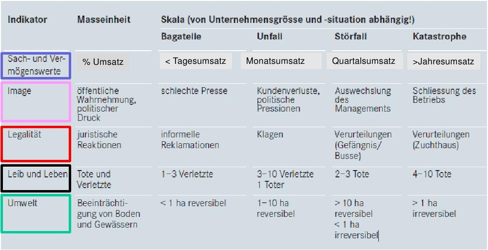
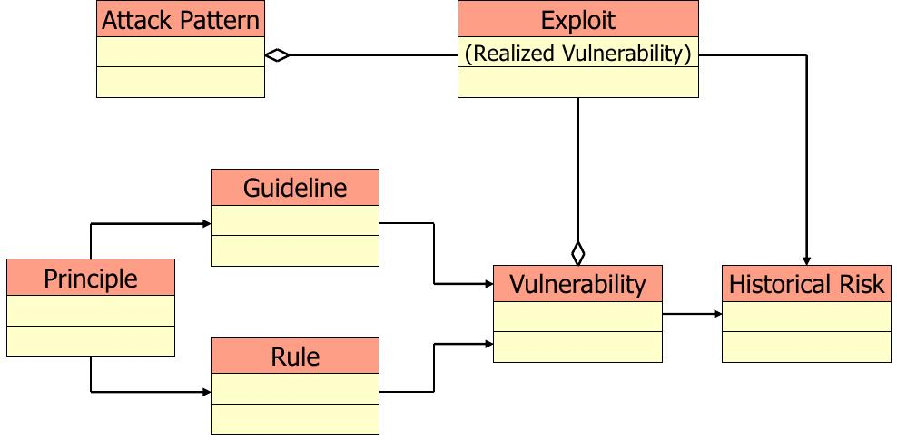

=============================
FS14 InfSi3 Repetitionsfragen
=============================

Antworten zu den Repetitionsfragen
==================================
Falls vorhanden befinden sich diese im GitHub Repository. Ergänzungen oder ganze Antwortensets sind jederzeit herzlich willkommen. https://github.com/moonline/HSR.modules.InfSi3

Symbolerklärung
===============
**[DP]**
Wissensfragen des Dozenten (Slides) für die Prüfung

**[EW]**
Wissensfrage, die über den Stoff der Vorlesung hinaus geht.

1 Information Security Management
=================================

**1.0.1.**
Skizzieren Sie das bereits aus InfSi1 bekannte Model und ordnen Sie die Begriffe Information, Controls, Vulnerabilities und Thread in der Skzze zu.

**1.0.2.**
Mit welcher Massnahme aus dem Massnahmenkatalog erreichen sie mit am wenigsten Aufwand am meissten Sicherheitsgewinn?

**1.0.3.**
Erklären Sie das Risikomodell und skizzieren Sie das Diagramm Kosten/Sicherheit. Tragen Sie darin sowohl die Kosten für Security wie die Kosten von Schäden ein.

**1.0.4.**
Was ist der Hauptgrund, weshalb IT Konzerne Sicherheitsmassnamhmen treffen?

1.1 Werte, Anforderungen an die Informationssicherheit
======================================================

**1.1.1.**
Erklären Sie die Tabelle mit den Schadenindikatoren.

**1.1.2.**
Nennen Sie einige Anforderungen, die Unternehmen aus gesetzlicher Sicht zu Informationssicherheit treiben.

**1.1.3.**
Fassen Sie die folgende Gesetzte oder Artikel in einem Satz zusammen:

a) DSG
b) Stgb Art. 179
c) HIPAA / TARMED
d) BankG Art 47
e) VSB 08
f) PCI
g) Fernmeldegesetz
h) SOX
i) FISA 1978
j) PATRIOT ACT 2001

1.2 Threads
===========

**1.2.1.**
Wie verändert sich die Bedrohung in Funktion von Motivation und Mitteln? Formulieren Sie Angreiferkategorien.

**1.2.2.**
Wer ist die NSA?

**1.2.3.**
Was ist Quantum? Erklären Sie den Vorgang.

2 Location Based Services & Datenschutz
=======================================

**2.0.1.**
Nennen Sie verschiedene Typen von LBS und welche Daten jeweils erhoben werden.

**2.0.2.**
[DP] Zählen Sie Dienste auf, bei welchen Sie Angaben zu Ihrer Position (Standort) an Dritte weiter geben (Web und Mobile).

**2.0.3.**
Fassen Sie die folgenden Gesetzesartikel in einem Satz zusammen:

i) DSG Art. 3: Begriffe
ii) DSG Art. 4: Grundsätze
iii) DSG Art. 7: Datensicherheit
iv) DSG Art. 8: Auskunfstrecht
v) DSG Art. 14: Tracking

**2.0.4.**
[DP] Sie beraten eine Anwaltskanzlei in Bezug auf Datenschutzfragen. Die Kanzlei bietet auf ihren Webseiten UsageTracking (z.B. Google-Analytics) und UserFeedback (z.B. Facebook “gefällt mir”) an.

a) Was weiss wer über die Webseiten-Besucher der Anwaltskanzei?
b) Was gilt es in diesem Zusammenhang zu beachten?

2.1 Methoden zur Lokalisierung von Objekten
-------------------------------------------

**2.1.1.**
Nennen Sie einige Dienste, wo sie passiv ihren Standort preisgeben.

**2.1.2.**
Wie funktioniert Standortbezogenes Surfen in Firefox und Chrome? Welche Daten werden an den Localisation Provier übermittelt, wenn kein GPS aber Wlan verfügbar ist?

**2.1.3.**
[DP] Handelt es sich bei Lokationsdaten um Personendaten?

**2.1.4.**
Wie funktioniert Lokalisierung über die IP Adresse?

**2.1.5.**
Ist die IP Adresse im Rahmen einer Identifizierung von Adressen von Downloadern und Weitergabe an Plattenfirmen, welche Nutzer mit Strafanzeigen und Schadenersatzforderungen konfrontieren, ein Personendatu oder nicht?

**2.1.6.**
Wie funktioniert "Cell Tower Localization"?

**2.1.7.**
Welche Daten gibt ein Mobilfunknutzer preis, der über GSM an einer Antenne angemeldet ist?

**3.1.8.**
Wie funktioniert Localization über Wlan? Welche Daten gibt der Nutzer preis?

**2.1.9.**
Was ist Lokalisierung über "Beacons"?

**2.1.10.**
Was sind e-Plate Long-Range Tags?

**2.1.11.**
Wie genaue Lokalisierung ist mit Bluetooth und RFID möglich? Wie genau mit GSP?

**2.1.12.**
Wie sieht die Datenschutzrechtliche Situation aus beim Einsatz von GSP Systemen zum Flottenmanagement und zur Arbeitszeitüberwachung?

**2.1.13.**
Was versteht man unter "bewusster Bekanntgabe von Lokationsdaten"? Machen Sie ein Paar Beispiele.

**2.1.14.**
Was versteht man unter "unbewusste Bekanntgabe von Lokationsdaten"? Machen Sie ein Paar Beispiele.

**2.1.15.**
Welche Informationen erhält Google über einen Nutzer?

**2.1.16.**
Was ist ein Browser Fingerprint und wie genau lassen sich Nutzer damit identitifizieren?

3 Software Security
===================

**3.0.1.**
In strongSwan gab es 2009 eine Buffer Overflow Verletzlichkeit durch unsachgemässe Benutzung von snprintf. Wie können potentiell gefährliche Funktionen in Sourcecode aufgefunden werden und wie kann verhindert werden, das später erneut eine Verletzlichkeit eingebracht wird?

**3.0.2.**
Erklären Sie, warum zunehmende Connectivity, Extensibility und Complexity von Software zu Security Problemen führt.

**3.0.3.**
Erklären Sie den Zusammenhang zwischen "Bugs", "Flaws" und "Defects" und die Begriffe.

**3.0.4.**
[DP] Sind die folgenden Fehler Bugs oder Flaws?

a) Rückgabewert von Read() ignored
b) Verwendung von strlen() auf einem Wert, der nicht garantiert mit einem 0-Byte terminiert
c) Speicherung von Benutzerpasswörtern als Klartext in der Datenbank
d) Passwort des Users mit memcmp mit Passwort in der DB vergleichen. Wenn der Rückgabewert von memcmp != 0 wird der Zugriff geblockt (memcamp("", password) gibt auch 0 zurück).

**3.0.5.**
Erklären Sie die drei Säulen von Software Security.

**3.0.6.**
Was ist Risiko (Definition). Skizzieren Sie grafisch, wie viel Geld in Security investiert werden sollte (qualitatives Diagramm).

**3.0.7a.**
Welches sind die drei "Best Practises", die am meissten Security bringen? Warum sind Massnahmen mit Blackhat Activities schwierig umzusetzen?

**3.0.7b.**
Ordnen Sie die folgenden Massnahmen den Artefakten zu (Massnahmen können auch mehreren Artefakten zugeordnet werden).

1) Security Operation
2) Code Reviews
3) Risk Analysis
4) Security Requirements
5) Penetration Testing
6) Risk-based Security Testing
7) Abuse Cases

i) Requirements & Use Cases
ii) Architecture & Design
iii) Test Plans
iv) Code
v) Tests & Test Results
vi) Feedback from the Field

**3.0.8.**
Erklären Sie "Barry Boehms Cost of Change Law".

**3.0.9.**
Auf welchen drei Säulen ruht Software Security Knowledge?

**3.0.10.**
Erklären Sie die Grafik.

**3.0.11.**
Erklären Sie den Unterschied zwischen den beiden Typen von Code Revision Tools.

a) First Generation Code Scanners
b) Advanced Source Code Analysis Tools

**3.0.12.**
Welche Elemente beinhaltet "Architectural Risk Analysis"?

4 Microsoft Security Livecylce
==============================

**4.0.1.**
Erklären Sie die folgenden Elemente des Security Livecycle:

a) Continious Process Improvement
b) Accountability

**4.0.2.**
Erklären Sie den "Security Development Livecylce". Welche Phasen werden durchlaufen?

**4.0.3.**
Erklären Sie die Begriffe und was für Fehler gefunden werden sollen / was die Massnahme bewirken soll.

a) Quality Gates, Bug Bars
b) Risk Assessment
c) Analyse Attack Surface
d) Thread Modelling
e) Fuzzy Testing
f) Dynamic Analysis
g) Static Analysis
h) Response Plan

5 Web Application Security
==========================

**5.0.1.**
Was wird alles unter dem Begriff "Web Applications" zusammengefasst?

**5.0.2.**
Beschreiben Sie die typische Web Application Architektur

**5.0.3.**
Was sind Cookies und wie funktionieren sie? Wie werden Cookies dargestellt im Request?

**5.0.4.**
Wie funktioniert Session Management im Web? Skizzieren Sie welche Sessions über welche Tiers laufen.

**5.0.5.**
Welche Arten von Cookies gibt es? Was sind Supercookies?

**5.0.6.**
Was sind E-Tags? Wozu können Sie missbraucht werden?

**5.0.7.**
Wer darf Cookies lesen und schreiben?

**5.0.8.**
Erklären Sie die "Same Origin Policy". In welche Fällen fällt eine URL unter die Policy?

**5.0.9.**
Wie wird mit 3rd Party Cookies Data Mining betrieben? Wie funktioniert dies trotz der "Same Origin Policy"?

**5.0.10.**
Was ist P3P und wie funktioniert es?

**5.0.11.**
Wie funktioniert Sandboxing?

**5.0.12.**
Welche Rechte und Möglichkeiten haben JavaScript (inklusive Html5 API's), ActiveX, Java Applets und Plugins auf dem Client?

5.1 OWASP
---------

**5.1.3..**
Was ist OWASP?

**5.1.2.**
Welches sind 3 häufigsten Verletzlichkeiten gemäss OWASP?

**5.1.3.**
Was sind Injection Flaws und welche Massnahmen unternehmen Sie dagegen?

**5.1.4**
Was ist "Broken Authentication and Session Management"? Welche Arten von Verletzlichkeiten gibt es und welche Massnahmen dagegen können unternommen werden?

**5.1.5.**
Was ist XSS? Welche Arten gibt es und welche Massnahmen helfen dagegen?

6 Web Application Security
==========================

6.1 Injection
-------------

**6.1.1.**
Firewalls blockieren den Verkehr zu den meisten Ports. Port 80 ist einer der wenigen offenen. Wie weit nutzt eine Firewall gegen Angriffe auf Applcation Level, insbesondere Applikationen, die Port 80 nutzen?

**6.1.2.**
Wieso konzentrieren sich Angriffe heute oft auf den Application Layer und nicht mehr auf die Schichten darunter?

**6.1.3.**
Wie funktioniert eine SQL Injection?

**6.1.4.**
Was ist die Technische Grundlage einer SQL Injection? Was macht ein Angreifer, wenn er Zeichen wie z.B: ' oder -- in ein Statement einschleust? Erklären Sie dies bezogen auf Daten/Datenauszeichnung.

**6.1.5.**
Welche Probleme können für die komplette interne Umgebung auftreten, wenn der Angreifer z.B. mit EXEC das DB Environment verlassen kann?

**6.1.6.**
Was ist eine Blind SQL Injection? Was eine Time Based SQL Injection?

**6.1.7.**
Was für Szenarios sind mit User Defined Functions und Injection denkbar? Erklären Sie, wie es möglich ist einen Tunnel von innerhalb des Systems nach aussen zum Angreifer aufzubauen.

**6.1.8.**
Nennen Sie einige Massnahmen um Injections zu verhindern.

**6.1.9.**
Ist es möglich, trotz Prepared Statement eine Injection zu verursachen?

6.2 Authentication & Session Management
---------------------------------------

**6.2.1.**
Erklären Sie den Unterschied zwischen Authentication und Authorization und Identification.

**6.2.2.**
Welche Anforderungen stellen Authentication & Session um zuverlässig aufgebaut zu sein?

**6.2.3.**
Erklären Sie die drei Faktoren der Authentication. Was heisst "strong authentication"?

**6.2.4.**
Erklären Sie "HTTP Protocol based Authentication", "Application Login" und "HTTPS Protocol based Authentication". Welche Authentication Schemas gibt es?

**6.2.5.**
Welche Probleme ziehen Form autocompletion mit sich und wie kann ich als Entwickler diese deaktivieren?

**6.2.6.**
Was ist "Back Button Relogin Vulnerability" und wie kann dies verhindert werden?

**6.2.7.**
Erklären Sie "User Enumeration" und entsprechende Massnahmen.

**6.2.8.**
Was ist SAML? Wie funktioniert es?

**6.2.9.**
Erklären Sie die SAML Begriffe IdP und SP. Was sind IdP-initiated und SP-initiated Authentications?

**6.2.10.**
Skizzieren Sie SAML based SSO mit Post Bindings und mit Artefakten.

**6.2.11.**
Welche Attacken für SAML gibt es? Welche Gegenmassnahmen gibt es?

**6.2.12.**
Welche Attacken gibt es, um Browser Sessions zu klauen?

**6.2.13.**
Warum sollten keine URL-based Sessions verwendet werden?

**6.2.14.**
Was ist Session Fixation? Welche Massnahmen gibt es dagegen?

**6.2.15.**
Welche restriktiven Cookie Parameter gibt es, um die Session zusätzlich abzusichern?

6.3 XSS
-------

**6.3.1.**
Was ist die Same Origin Policy? Erklären Sie, welche Domains als Same Origin behandelt werden, und welche nicht.

**6.3.2.**
Wie können über eine XSS Lücke Sessions geklaut werden?

**6.3.3.**
Erklären Sie die drei Arten von XSS.

**6.3.4.**
Welche Massnahmen helfen gegen XSS?

7 Mobile Security
=================

**7.0.1.**
Definieren Sie "Mobile Applications Plattform". Was gehört alles zu einer solchen Plattform?

**7.0.2.**
Welche Fünf Schritte schlägt OWASP im Threat Modelling Process vor, um mögliche Sicherheitsprobleme ausfindig zu machen?

**7.0.3.**
Erklären Sie am Beispiel Moves deren Architektur/Funktion, Business Case, Use Case, User und Vertrauensgrenzen. Welche Daten werden gesammelt und wo werden sie gespeichert? Welchen Schutz benötigen welche Daten?

**7.0.4.**
Welche Kanäle können beim Smartphone als Angriffskanäle benutzt werden?

**7.0.5.**
OWASP Schlägt drei Stepts vor, um Mobile Risiken zu identifizieren. Erklären Sie diese.

**7.0.6.**
Nach welchen Kategorien werden Thread Agents eingeteilt?

**7.0.7.**
Welche Angriffsszenarien gibt es allgemein bei einem Mobiel Device? Nennen Sie 5 Typen.

**7.0.8.**
Welche Rechte haben Apps? Wie dürfen sie auf den Speicher zugreifen?

**7.0.9.**
Wie kommt Malware in den App Store?

**7.0.10.**
Welche ANgriffe werden Auf Kommunikationschannels gefahren?

**7.0.11.**
Wozu dienen Apps wie Flexspy und welche Probleme bringen sie mit sich?

8 Smartphone Security
=====================

**8.0.1.**
Welche Risiken bietet ein Gerät, auf das ein Angreifer Zugriff hat (Privat & Business)?

**8.0.2.**
Welche drei Sicherheitsmechanismen bieten Smartphones seitens Hardware?

**8.0.3.**
Welche drei Sicherheitsmechanismen bieten Smartphones seitens Betriebsystem?

**8.0.4.**
Welche vier Sicherheitsmechanismen bieten Smartphones um Apps abzusichern?

**8.0.5.**
Wie werden bei iOS und Android die Daten verschlüsselt? Wie werden sensitive Daten (Keys, Passwörter) abgelegt?

**8.0.6.**
Welche Signaturmechanismen gibt es bei iOS und Android?

**8.0.7.**
Was kann mit einem gestohlenen iPhone angestellt werden? Welche Daten sich unter welchen Voraussetzungen zugreifbar, welche nicht?

**8.0.8.**
Wie funktioniert die Filesystem- und Fileverschlüsselung?

**8.0.9.**
Was passiert beim Lösen von Files/Daten? Wie weit ist eine Wiederherstellung möglich?

**8.0.10.**
Was können Forensic Tools leisten?

8.1 EJPD Architektur
====================

**8.1.0.**
Warum ist mTan unsicher?

**8.1.1.**
Was ist MobileID? Was kann es und wem muss dazu vertraut werden?

9 Sicherheitsüberprüfung
========================

**9.0.1.**

10 E-banking & Mobile Banking
============================

10.1 E-banking
-------------

**10.1.1.**
Nennen Sie einige mögliche Angriffspunkte beim Mobile Banking.

**10.1.2.**
Welche Angriffspunkte gibt es bei der Authentifizierung mit mTan? 
Wo schützt das Verfahren, wo nicht?

**10.1.3.**
Vergleichen Sie die Sicherheit der Personlichen Daten (Kontoeinsicht) und 
die Sicherheit einer Transaktion (Integrität) bei mTan.

**10.1.4.**
Wie sieht gleiches bei Challenge-Response Tokens aus?

**10.1.5.**
Was ist eine Strenge authentisierung?

**10.1.6.**
Wie problematisch sind Malware auf dem Computer und Man-in-the Middle über alle Techniken gesehen?

10.2 Mobile Banking
------------------

**10.2.1.**
Wie sieht die Malware-Problematik beim Mobile Banking aus?

**10.2.2.**
Welche techniscen Möglichkeiten gibt es, um die Mobile Banking Sicherheit zu verbessern?

**10.2.3.**
Erklären Sie, wie die PhotoTAN App von Raiffeisen funktioniert, 
welche Sicherheitsmassnahmen sie mitbringt und warum sie nur auf dem Destop funktioniert.

**10.2.4.**
Welche Konzepte aus der PhotoTAN App wurden übernommen für die Mobile Banking App?

**10.2.5.**
Mit welchen Sicherheitsmassnahmen wird die Mobile Banking App abgesichert.

**10.2.6**
Wie funktioniert das Konzept der mehrfachen authentisierungslevel?

11 Forensik
===========

**11.0.1.**
Was ist digitale Forensik?

**11.0.2.**
Nennen Sie einige Bedrohungen / Tatwerkzeuge, die Cyberkriminelle nutzen.

**11.0.3.**
Warum werden sichergestellte Datenträger kopiert, bzw. über ein Gerät angeschlossen, 
das Schreibschutz gewährleistet?

**11.0.4.**
Was wird bei der Aufbereitung von Sichergestelltem Material gemacht?

**11.0.5.**
Wie weit wird die Auswertung manuell und durch Software durchgeführt?

**11.0.6.**
Wie werden Smartphones ausgewertet, wenn kein direkter Zugriff auf die Daten über
einen Rechner besteht? Wie wird dabei sichergestellt, das trotz der Veränderungen auf dem 
Gerät die Gerichtsverwertbarkeit nicht beeinträchtigt wird?

**11.0.7.**
Aus welchem Grund ist die Datenmenge, die das Labor auszuwerten hat seit 2007 stark angestiegen?

**11.0.8.**
Welchen Herausforderungen muss sich die digitale Forensik immer wieder stellen?

