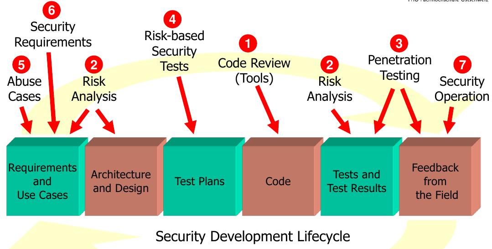
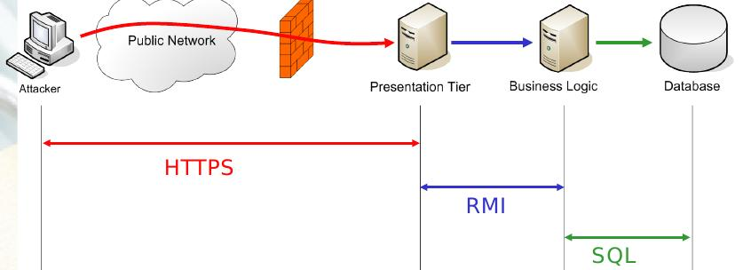

===================
FS14 InfSi3 Summary
===================

0 Admin
=======

* MobileQuiz sind Prüfungsstoff (existieren bis jetzt nicht)
* Closed Book Prüfung
* Selbstlernstoff is Prüfungsrelevant

1 Information Security Management
=================================

Value: Unternehmen fürchten sich vor Gesetzesverstössen -> Sicherheit

   Informationssicherheitsmanagement

Durch Investition in "M2 Organisationsmanagement" kann mit wenig Aufwand viel Erzielt werden.
   

   Welches Risiko soll eingegangen werden?

   
.. note:: Risiko: Es muss eine Bedrohung da sein.

1.1  Werte, Anforderungen an die Informationssicherheit
=======================================================

.. figure:: img/1.3.jpg

   Schadenindikatoren und Bewertungsskalen

   

   Gründe, warum IT Unternehmen Sicherheit betreiben

1.2 Bedrohungen
===============

Früher Script Kiddies, heute professionelle Hackerunternehmen.

   
   Bedrohung in Funktion von Motivation und Mitteln (Angreiferkategorien)

2 Location Based Services und Datenschutz
=========================================

.. note:: LBS: Location Based Services

2.1 Services
------------

Services wie Maps, Local Searches, Tracking, Trafic, Friend finders, Augmented Reality, ...

   Location Based Services Examples

* Google LBS
	* Navigation / Maps
	* Buzz (Around Me)
	* Googles (Augmented Reality)
	* Waze (Trafic)
	* Google Now
* Social LBS
	* Facebook Places
	* Friendthem (eingeloggte Twitter/Facebook User in der Nähe)
	* Gowalla

2.2 Schweizer Datenschutzgesetz
-------------------------------

* 4.3 Bearbeitung Personendaten:
	* Nur für bei Beschaffung angegebene Zwecke
	* Nur für den Umständen ersichtliche Zwecke
	* Oder gesetzlich vorgegebene Zwecke
* 4.4 Für Betroffene muss erkennbar sein:
	* Die Beschaffung von PD an sich
	* Zweck der Bearbeitung
* 4.5 Bedingungen bei Einwilligungserfordernis durch Betroffene (sonst Einwilligung ungültig):
	* angemessene Information des Betroffenen
	* freiwillige Einwilligung
	* Besonders schützenswerte PD: Bewilligung muss ausdrücklich erfolgen
* 7 Datensicherheit: Schutz gegen unbefugtes Bearbeiten durch: 
	* angemessene technische Massnahmen
	* angemessene organisatorische Massnahmen
* 8 Auskunftspflicht ob Daten über Person bearbeitet werden: 
	* Jede Person kann Auskunft verlangen
	* Beim Inhaber einer Datensammlung
* 14 Besonders Schützenswerte Personendaten + Persönlichkeitsprofile
	* Informationspflicht bei deren Beschaffung
	* Gilt auch, wenn Daten bei Dritten beschafft werden
	* Mindestens mitzuteilen sind:
		* Inhaber der Datensammlung
		* Bearbeitungszweck
		* Kategorie der Datenempfänger bei Datenbekanntgabe

2.3 Lokalisierungstechnologien (passiv)
---------------------------------------

* Google Maps "mein Standort"
	* Fragt Browser nach Standort
	* Firefox lokalisiert diesen über IP und Funkzugangsknoten
	* google Location Service erhält nicht die Location sondern:
		* IP
		* Funkzugangsknoten
		* random ID für mein Rechner (von Google zugeteilt, alle 2 Wochen gelöscht)
		
* Lokalisierung über IP
	* Anschlusserkennung / Telefonnummer / Mac Adresse / IP
* Logistep
	* Identifizierte Musikdownloader und gab diese Info an Auftraggeber weiter.
	* CH-BR entschied, das IP Adresse, die an User gebunden ist ein Personendatum ist
	* In DE kein Personendatum
* Handylokalisierung
	* Über mehrere Masten oft genauer als eine Zelle
	* GSM Antennenstandortdatenbanken -> Lokalisierung über Zellenif
	
.. figure:: 2.3.jpg

* WLAN
	* Auch lokalisation möglich
	* Zuordnung über Wlan Datenbanken
* Beacons (Bluetooth, RFID)
	* Kurzdistanzbereich -> Messen, Geschäfte
	* long-range RFID Tags für Fahrzeugidentifikation in Kennzeichen eingelassen
* GPS
	* bis 15 Meter genau
	* Mit Korrekturdaten SBAS/EGNOS bis 30cm
	* Tracking von Fussballspielern möglich
	* z.B. für Flottenmanagement -> Fahrzeugracking
	* Genauigkeit hängt von der Anzahl
	* AGPS: Korrekturdaten (Azimute) für die genaue Position der Sateliten wird nicht von den Sateliten heruntergeladen sondern vom Netz geladen
	* Diferenzielles GPS: Basisstation deren Position bekannt ist. Dadurch erhält man Korrekturdaten zur Positionsoptimierung. Daten werden über GSM oder über den GPS Kanal übertragen.
		* -> Ermöglicht Positionierung im cm - mm Bereich
	
	
2.4 Aktive Bekanntgabe von Lokationsdaten
-----------------------------------------

* Foursquare: Standort einchecken (Trophähe für meist-Einchecker an best. Ort)
* Flickr Foto Upload mit Positionsangabe auf Karte
* Wolfram Alpha Facebook Report (Zugang geben für Analyse der Daten)
* Beim Hochladen von Fotos des Smartphones werden in den Metadaten auch Positionsdaten gesendet

2.5 Unbewusste Bekanntgabe von Lokations- und Personendaten
-----------------------------------------------------------

* Apps wie z.B. Activity Trackers
	* Standort, Geschwindigkeit, ...
* Google Suche
	* IP/Cookie, Browser Footprint -> Matching von Personen zu Suchbegriffen und umgekehrt
* Gesammelte Lokationsdaten einsehen Smartphone -> Datenschutzeinstellungen
* CDN Netzwerke wissen relativ viel über uns -> 20% des Verkehrs
* Provider wissen auch viel über uns / Proxy

.. note:: Mit Lokationsdaten können sensible Profile erstellt werden

.. note:: Viele Informationen über eine Person können für sehr gezielte Attacken / Social Engineering missbraucht werden

3 Softwaresecurity
==================

* Software ist schlecht (verwundbar) und wird deren Umfeld wird deshalb stark kontrolliert
	* Firewall
	* VPN
	* Proxy Filter
	* ...
	
* **Ziel**: Software sollte selbst stabil und sicher sein und sich verteidigen können
* Buffer Overflows stark rückläufig

Grund für Sicherheitslöcher
---------------------------

* **Vernetzung**: Heute sind fast alle Apps Netzwerkfähig und am Netz
	* Alte Applikationen sind am Netz, die nie ans Netz gehen hätten sollen
* **Plugins**: Software kann sicher sein, Plugins bringen wieder Löcher rein
	* Plugins von Webbrowsern -> Marktplatz, jeder kann was zur Verfügung stellen -> keine Qualitätskontrolle
	* Dynamisch ladbare Treiber und Module verringern die Sicherheit des OS
	* Skripting-Erweiterungsmöglichkeiten von Frameworks wie Java oder .Net gefährden Software
* **Komplexität**: Applikationen wachsen konstant
	* Fehlerrate nimmt quadratisch mit Codegrösse zu
	

Sicherheitsrelevate Fehler
--------------------------

.. note:: Bugs+Flaws = Defects

* Security Bug: Fehler in der Implementation, z.B. Falsche Verarbeitung von Rückgabewert einer Funktion
	* Implementation Level -> lässt sich gut automatisiert finden und beheben
	* Bsp: Buffer Overflows, Race Condition, unsafe system calls
	* Bsp: Rückgabewert einer Funktion ignoriert
		.. code-block:: c
		
			read(fd, userEntry, sizeof(userEntry));
			
			
* Security Flaw / Verhaltensfehler, Designfehler
	* Design-Level-Fehler
	* Nicht detektierbar durch automatische Tools
	* Bsp: Methoden overriding, error handling, type safety confusion
	* Bsp: Vergleich auf Klartextpasswort (Passwörter sollten nie als Klartext abgelegt werden).
		.. code-block:: c
		
			comparison = memcamp(userEntry, correctPasswd, strlen(userEntry));
			
			
* Security Defect (50% Bugs, 50% Flaws)

Software Artefakte
------------------

   Drei Pfeiler tragen Software Security

* Nicht genügend Resourcen sind vorhanden, um beliebig Massnahmen zu ergreifen -> Die richtigen müssen ergriffen werden
	* Knwowledge: Aus der Vergangenheit lernen
	
Risk Management
...............

* Software kostet Geld -> Sicherheitslöcher auch -> Balance finden

1) Risiken identifizieren (Business)
2) Probleme in der Technik die zu Business Risiken führt, identifizieren
3) Risiken elliminieren
4) Strategie zum Fixen definieren
5) Strategie ausführen

* Primärproblem: Software muss ausgeliefert werden, Verzug führt zu massivem Geldverlust
	* Firmen schauen vor Allem darauf
	* Produkt reift beim Kunden
* Sicherheitslöcher: Gefahr eingeklagt zu werden oder nicht verfügbar zu sein

Best Practises
..............

   
   Massnahmen, die viel bringen (von oben nach unten abnehmend, die obersten 3 am meissten)

* Abuse Case: Was will der Hacker? (Definiert mögliche Angriffe, Hacker Use Case)
* Code Review: Tools finden nur Bugs, keine Flaws -> Daher auch Code Reviews auf Architektur und Konzepten
* Aktuell wird leider die meisste Software erst am Schluss mit Penetrationtesting getestet -> problematisch
* Fusing: Penetrieren einer Applikation / Protokoll mit Randoom Content in best. Fehlern -> Aufwendig und gezielt

Effizienteste Methoden
^^^^^^^^^^^^^^^^^^^^^^

1) Code Review (Tools)
2) Risiko Analyse (Architektur)
3) Penetration Testing

Software Security Knowledge
...........................

.. note:: Angewandtes Wissen

* Prescriptive Knowledge
	* Principles
	* Guidelines
	* Rules
* Diagnostic Knowledge
	* Vulnerabilities
	* Exploits
	* Attack patterns
 Historical knowledge
	* Historical risks

.

.. figure:: img/3.8.jpg

   Software Security Unified Knowledge Architecture

* Grundprinzipien: z.B. Least Priviledge
* Guidelines: z.B. Security Pattern Buch
* Vulnerabilities: bei existierenden ähnlichen Produkten schauen, was es gibt (Vulnerability Database)
* History: Lernen aus der Vergangenheit

   Wissen, das man pflegen muss

Coding Rule Sets
^^^^^^^^^^^^^^^^

* https://securecoding.cert.org (Cert Code guidelines für verschiedene Sprachen)

Architectural Risk Analysis
...........................

* Perform Attack Resistace Analysis: Grosse Risiken müssen raus, kleine können getragen werden
	1) Schwachstellen in Architektur nach Erfahrung zu finden
	2) Können Attack Patterns auf meine Architektur angewandt werden?
	3) Sind Exploits möglich
	
	* Findet keine unbekannten Attacken
	
* Perform Ambiguity Analysis (Unklarheit / Mehrdeutigkeiten in Architektur finden)
	1) Architektur auf ein Blatt bringen (Top Level) -> Zeigt, wo kritische Komponenten sind
	2) Ausenstehender soll anhand der Dokumentation erklären, wie es funktioniert/geschützt ist -> Sagt der was anderes: Architektur muss überarbeitet werden da für die Implementation Mehrdeutigkeiten bestehen
	
	* Braucht externes Security Team
	
* Perform Weakness Analsis
	1) Schwachstellen in Interaktion zw. Meiner App und dem genutzten Framework finden (Korrekte Verwendung der API?)

4 Microsoft Security Livecycle
==============================

Core Concepts
-------------

* Schulungen
* Continious Process Improvement
* Accountability
	* Wenn was passiert, schnell rausfinden was passiert ist (Release and Response)
	* Zugriff (Public Repo)
	* -> Damit schnell reagiert werden kann

.

.. image:: img/4.1.jpg
   :width: 50 %

* Phasen von oben nach untern, Verbesserung der generellen Sicherheit von links nach rechts

* Requirements:
	* Quality Gates, Bug Bars: Produkt soll nicht beim Kunde reifen sondern erst freigegeben werden, wenn es Qualitätsprozesse durchlaufen hat und die Bug/Flaws Rate/Woche eine bestimmte Limite unterschreitet
	* Einbezug von Experten
	* Risk Assessment: Grosse Risiken minimieren, kleine tragen
* Design:
	* Analyse Attack Surface: z.B: Einhalten von "Least Priviledge"
	* Thread Modelling: Risk Checklisten durchgehen, Regeln anwenden wie z.B. BSI Handbuch
* Implementation
	* Code Analysis Tools
	* Keine deprecated functions
* Verification:
	* Fuzzy Testing: Mit Randoom Input fluten
	* Dynamische Analysen: Flaws finden, ist es richtig implementiert worden?
	* Statische Analyse: Bugs finden
* Release:
	* Response Plan: Verfügbarkeit von Personen für Ernstfall

.. warning:: Über Microsoft Security Livecycle kommt an Prüfung eine Frage

	
* Manuelle Code Reviews:
	* Für Bereiche mit sensitiven Daten / Privacy
	* Für Crypto Umsetzung
* Penetration Testing

5 Application Security
======================

Was sind Web Apps
-----------------

* Client-Server Architektur
* Universellen Client (Browser)
	* little control of client (Browserdivergenz, Häufige Softwarechanges)
	* Zugriff von überall
* Multi-Tier Architektur
* Direkter Zugriff zu Backend Data

* Zugriffsschutz: Authentifizierung
	* Policy: Wer darf was, Rollen definieren
	* Login: Meist Personalisierung
* Angreifer können auch identifiziert werden aber nicht authentisiert (Identitätscheck)
* Resourcen können statische (z.B: Images) und dynamische (z.B. Services, Programme)
* Monitoring, Logging extrem wichtig: Wissen, was die Leute mit meiner App tun
	* Transparenz: Kunde muss wissen, was mit seinen Daten getan wird

	
Sicherheitsanforderungen an Dokumente
-------------------------------------

* Twitter
* Posts: public, i
* Benutzer Konten: private
	* Passwort, Mail: c, i
	* Benutzername, Standort, Beschreibung: Public
* Followers: public: i, a
* System Statistics: intern: c, i, a
* Hashtags: public: i

.. note:: Zu ungenau spezifizierte Sicherheitsanforderungen führen zu schwacher oder unnötig umgesetzten Sicherheitsmassnahmen

* Availability: Eigentlich immer eine Anforderung -> System nicht verfügbar -> ich verliere Geld

Sessions
--------

* Basic Authentication: Unbedingt mit SSL schützen, da die Werte im Klartext übertragen werden
* TCP Session: Identifiziert über IP/Port

.

* Kontext geht verloren, weil Session immer nur für einen Abschnitt gilt

.

* Cookie: Hinzufügen eines Gedächnises des Webs auf Application Layer -> ermöglicht Tracking
* Cookie das der Server hsr.ch gesetzt hat darf es auch nur lesen

.

* Secure Cookie: Darf nur über sicheren Kanal übertragen werden
* Http-only Cookie: Darf nicht mit JS ausgelesen werden

.

* 3rd Party Cookies: Suchterm von Altavista wird an Client gesendet -> Browser schickt Info von Altavista an Werber (Doubleclick.net)

Flash Cookie
............

   
   Flash Cookie (Local Shared Objects LSO)

Dom Storage
...........

   Web / Dom Storage

E-Tag
.....

* E-Tag: Enthält Info, ob es sich beim Browser im Cache befunden hatte (Caching Kontrolle)
	* Kann als Seitencookie genutzt werden
	* ID zu aufgerufenen Seiten

Cookie Security Issue
.....................

* Cookies müssen gegen Diebstahl geschützt werden -> SSL
* Cookie Theft
	* Reading Cookies as they are transmitted
	* Reading stored Cookies after somebody left the computer
	* Reading Cookies with JavaScript
	* Reading Cookies remotely: Cross Site Scripting (CSS, XSS)
* Cookie Overwriting
	*Forging Cookies

Same Origin
...........

* Wenn Protokoll, Host und Port gleich sind -> Same Origin
* IP != Url (nicht same Origin), aber wenn die gleiche Seite von unterschiedlichen Servern unter dem gleichen Domainnamen ausgeliefert wird -> same Origin

P3P Privacy Policy
..................

* Website liefert Policy aus, was mit den Daten geschieht
* Client hat Policy
* Matcht die Policy nicht, wird die Seite nicht aufgerufen
* Problem: Policy ist Selbstdeklaration

.

Sandbox
.......

* Zugriff auf Rechner nur in Sandbox erlaubt

.

* Webseiten können irgendwohin noch Verbindungen öffnen

Client Side Code Execution
--------------------------

* Scripts
* Java Applets
* Plugins (z.B. Pdf Viewer)
* ActiveX
* Silverlight

.. note:: Html5 Elemente bieten viel, was Java oder Plugins zur Verfügung gestellt hatten -> ohne "Warnung" verfügbar

* Video, Audio
* Local Storage
* Local DB
* Geolocation
* Video Capture

OWASP
-----

.. image:: 5.13.jpg
   :width: 80 %

.. figure:: 5.14.jpg
   :width: 80 %
   
   OWASP Tut. Serie 1
   

.. figure:: 5.15.jpg
   :width: 80 %

   Web Application Sec. Status

.. figure:: 5.16.jpg
   :width: 80 %

   OWASP Top 10 Vulnerabilities

.. image:: 5.17.jpg
   :width: 80 %

   
Injection Flaws
...............

* Sämmtliche User Inputs müssen validiert werden
* Validationsmechanism
	* Whitelisting (Verbiete alles, erlaube einiges)
	* Blacklisting (Erlaube alles, verbiete einiges)
	* Bad Data entschärfen (Escapen)

	
SQL Injection Protection
........................

* Review
* Avoid external Params
* Limit privileges of App
* Validate Input
* Use system functions instead of own

Broken Authentication and Session Management
............................................

* Authentication Protection
	* general
		* Keep Design simple
		* No own crypto implementation
	* credential rules
		* avoid short pw
		* limit login attemps
		* log failed login
		* implement pw length control (for user)
		* do not store passwords plain
		* do not transmit credentials plain
		* implement secure pw recovery mechanism
* Session Management Identifiers
	* Cookies (Stored in browser (Session cookies: Valid until browser is closed; Secure cookies: must be transmitted via SSL)
	* forms (Session ID added in http request URL (GET) and  added in http request body (POST))
	* specific path (http://www.cnlab.ch/applikation/G5TZ56IU5760?input=test)
	* SSL (Using SSL session ID)
* Session Protection
	* uniqueness
	* unpredictable
	* identifiable at all tiers (map intern -> extern), log at all tiers

Cross Site Scripting
....................

* stored (forum, comments, messages, personal profile, mail/news archive)
* reflexted (non persist) -> 404 page, app input error message, search pages
* DOM injections
* XSS Protection
	* whitelist validation
	* encoding of all output data, params too
	* app-level firewalls
	* rules
		* RULE #0 - Never Insert Untrusted Data Except in Allowed Locations
		* RULE #1 - HTML Escape Before Inserting Untrusted Data into HTML Element Content
		* RULE #2 - Attribute Escape Before Inserting Untrusted Data into HTML Common Attributes
		* RULE #3 - JavaScript Escape Before Inserting Untrusted Data into JavaScript Data Values
		* RULE #4 - CSS Escape And Strictly Validate Before Inserting Untrusted Data into HTML Style Property Values
		* RULE #5 - URL Escape Before Inserting Untrusted Data into HTML URL Parameter Values
		* RULE #6 - Sanitize HTML Markup with a Library Designed for the Job
		* Bonus Rule #1: Use HTTPOnly cookie flag
		* Bonus Rule #2: Implement Content Security Policy

6 SQL Injection
===============

   Firewall grants access to TCP ports 80/443 (HTTP/HTTPS)

Stored Procedures
-----------------

* Können in einer DB Stored Procedures ausgeführt werden, so kann dies als Shell missbraucht werden
* Standardmässig deaktiviert
* Wenn DB mit Domain Admin Rechten läuft, kann ein Angreifer mit den Rechten des Domain Admin alles machen, was dieser auch kann

Time Based Injection
--------------------

* Lang dauernde Funktion verwenden, z.B. Benchmark
* Kein sichtbarer Output -> Benchmark(function(abc)) laufen lassen. Antwortet der Browser verzögert, so hab ich die Bestätigung, das Injection funktioniert hat
* -> Bedingung, z.B wenn Passwort mit h anfängt -> Benchmark. So kann Ohne Output mit einem Skript die ganze DB ausgelesen werden

User Defined Function UDF
-------------------------

   
   1 Malware hochladen

   

   
   2 dll schreiben
   
   

   3 function, die dll called
   
   

   4 malware macht einen Tunnel nach aussen macht
   
   
DNS Tunnel
----------

* Von intern mit Malware DMS Request absetzen mit Daten im Payload
* DNS Server der Firma macht rekursive Abfrage
* Über die rekursive Abfrage landet die Anfrage schliesslich beim DNS Server des Hackers
* Über das Log des DNS Servers kann der Hacker an die Daten kommen

Fehlermeldungen
---------------

* Fehlermeldung ins Log schreiben
* USer Token (id) ausgeben
* User kann mit Token dem Help Desk anrufen

How to Protect
--------------

* Entry Server terminiert SSL
* Problem wenn Entry Server Strong input Validation macht -> keine detailierte Fehlermeldung

   
   

   
   

* Problem wenn einer beim App-Server ausbrechen kann: Voller interner Zugriff da er hinter den login Tears ist

.

Whitelisting
------------

* Problem: Alle erlaubten Fälle müssen bekannt sein

Blacklisting
------------

* Problem: deckt nie alles ab

Markup Language
---------------

* Besteht aus Markup und Content
* Zeichen, die den Kontext ändern können sind gefährlich -> SQL: Hochkomma
* -> Gefährliches Zeichen ist vom Kontext abhängig
* -> Funktioniert bei jeder Sprache
* Codierte Daten (z.B. &nbsp) immer nur einmal decodieren

Solution
--------

* Prepared Statement verwenden
	* Aufpassen! Nie Statements oder Stored Procedures dynamisch bauen!
* Encoding
	* Im aktuellen Kontext gefährliche Zeichen escapen
* Errormeldungen
	* Nur generische Fehlermeldungen mit Token zurückgeben

7 Identity and Access Management IAM
====================================

.. note:: Authentication: Überprüfen, ob der User wirklich der ist, den er vorgibt zu sein

Gründe für IAM
--------------

* Gesetz (DSG, Bankgesetz, Hacker Strafbestand)
* auditing / tracability of Information
* privacy

Single Sign On SSO
..................

* Viele Helpdesk Calls wegen Passwörtern -> SSO reduziert Help Desc Calls
* Problem: Stark hmogene IT-Landschaften
* Benutzer Stammdaten befinden sich an verschiedenen Orten / Datenbanken, die z.T. nicht kompatibel sind

Kerberos
........

WLAN
....

   MPP WLAN-Access via VPN (Captive Portal)

Server Zugang
-------------

   Switch Authentication and Authorization Infrastructure

* Hochschulen / Institute haben Abkommen, das ein Benutzer zugelassen wird, wenn er in einem Partnersystem zugelassen wurde

Federation
----------

* Diejenigen, die in einem Club mitmachen, vertrauen einandern (Organisationen)

.

.. note:: Benutzername (z.B: Email) ist nicht unsere Identität!

Shibboleth: Process/message Flow
................................

Passwort Manager
----------------

* Browser speicher Passwörter
* Autofill liefert Personas (Zusatzinformationen)
* LastPass: Generiert Passwörter, check Qualität, hat auch einmalpasswörter

8 Authentication
================

.. note:: Unterschied Authentisierung (Wer bin ich) und Authorisierung (Was darf ich)

.. note:: Starke Authentisierung: 2 Komponenten von WhatIAm, WhatIKnow, WhatIHave kombiniert.

   What does authentication mean?

   Browser Authentication

   Back Button Vulnerability: 302 Redirect schicken um zu verhindern, das man über BackBackButton klick das Post Formular mit den Logindaten nochmals absendet

.. note:: 2 Faktor Authorisierung minimiert das Problem der Username oder Password Enumeration.

   User / Password Enumeration

Security Assertion Markup Language SAML
---------------------------------------

   SAML is Single-Sign-On for the web

   Web Browser SSO Profile

   Attacking Points

   Prevent Attacks

.. note:: Security Frameworks Nutzung: Framework richtig konfigurieren, ansonsten drohen schwere Lücken!

Session Handling Attacks
------------------------

.. note:: HTTP Only Cookie: Wird nicht per JS ausgelesen -> Session Cookies immer setzen, ausser wenn Ajax im Einsatz

.. note:: Aufpassen: In Applikationsframeworks wie z.B. .Net die Session ID immer aus dem Cookie auslesen und nie auch aus der URL, damit ein Angreifer nicht ein Link mit einer Session verschicken kann

   Remember me: Referer Log (versehentlich public)

   Session Fixation (Versand der Session von Angreifer an User, dieser loggt sich damit ein und loggt damit den Angreifer ein.)

* Lösung: Session wechseln nach erfolgreichem Login

   Session Stealing Prevention

XSS
---

.. note:: Origin: Host+Protokol+Port (Nicht gleiche Origin: https/http, subdomain (shop.googe.com), google.com statt www.google)

   Same Origin Policy

   Same Origin Policy

   Stored XSS

9 Mobile Security
=================

   Antennen besitzen verschiedene Antennen für verschiedene Sektoren (Abstrahlwinken) und Technologien (2G, 3G, 4G)

* Bandbreite pro Sektor ist limitiert, Frequenz limitiert Datenrate
* Mehr Leute pro Sektor -> Überlast

.. note:: RAN: Radio Access Network

* Provider kaufen Lizenz bei Hardwareprovider und zahlen pro Kapazität -> Kosten, limitiert
* Youtube Verteilung wird durch Proxies geregelt
* Vertrag limitiert Bandbreite auf Gerät
* Content Anbieter limitieren auch Bandbreite -> Roundtrips
* Signallaufzeit vernachlässigbar, Zeit braucht Dataprocessing
* Anzahl Nutzer nicht kontrollierbar

.. figure:: img/9.2.jpg

   Mobile Applications Platform

.. figure:: img/9.3.jpg

   Mobile Applications Thread Modelling Process

OWASP Thread Modelling Methodik
-------------------------------

1. Understand and Describe Application Architecture
2. Identify Security Objectives (Data)
3. Identify Threat Agents
4. Identify Methods of Attack (Vulnerabilities)
5. Define Controls (Prevent, Mitigate Attacks)

Beispiel Moves
..............

* Nutzt GPS und Sensoren zur Aufzeichnung der Bewegung
* Aktivitäten werden analysiert (z.B. Bus / Rad fahren)
* Stillstandzeiten können benannt werden (z.B: Work)

1. App Functions kennen lernen
^^^^^^^^^^^^^^^^^^^^^^^^^^^^^^

2. Daten
^^^^^^^^

* Daten werden mit andern Apps ausgetauscht
* Erfasst werden: Device, Location, Credentials, 3rd Party Data
* Unklar, wo Daten abgelegt werden

Thread Agent Identification
---------------------------

Step 1: Take the list of all sensitive data (or information to protect) listed in Section Mobile Data
Step 2: Make a list of all the ways to access this data
Step 3: Identify the attackers using the ways i.e. the medium to access sensitive data

   Thread Agent Categories

Attack Szenarios
................

1. Local Memory / Storage based methods
2. OS and Application Level Methods
3. Endpoints Based Methods
4. Communication Channel Based Methods (Wireless interfaces based methods)
5. Miscellaneous Methods (microphone, camera)

.. note:: Biometrische Merkmale eignen sich nur zur Identifizierung und nicht als Secret!

   2. OS and Application Level Methods: Zugriffskontrolle

   Malware im AppStore

.. warning:: Bericht zu "Malware in Appstore" Zusatzmaterial Prüfungsrelevant

   4. Communication Channel Based Methods: OpenBTS und OpenBSC

.. warning:: Smartphone Development Guide Prüfungsrelevant

10 SSO Portal eJDP
==================

11 E-Banking / Mobile Banking
=============================

E-Banking
---------

   Attack Points
   

mTan
....

   Login

   Login Attack Szenarios
   

   Transaction Signature
   

Challenge-Response Token
........................

   Login
   

   Transaction

Vergleich
.........

Strong Authentication
---------------------

Mobile Banking
--------------

* Problem, da beide Faktoren der 2-Faktor Authentisierung auf einem Gerät

* Hardening: Full functionality on a single device - Mitigate risk through technical measures
* Multiple authentication levels: Limit the functionality depending on strength of authentication

   Hardening Example: Raiffeisen integrated PhotoTAN App

   Hardening: Technical measurements
   

   Hardening: Multiple Authentication Levels
   

   Hardening: Multiple AUthentication Levels
   

   Long term Cookie
   
   

12 Sicherheitsprüfungen
=======================

Gründe für Sicherheitsprüfungen
-------------------------------

* Interne Vorgabe
* Regulatorische/Gesetzliche Vorgabe
* Zertifizierung (Image)

Bedrohungen
-----------

* Intern
* Extern

Bedrohungs-Ebenen IT
--------------------

* Prozess (change-, operation-, incidentmanagement)
* Appliktaion (komerzielle / custom software)
* Infrastrutur (Netzwerk / IT-Systeme)

.. note:: Bei einer **Sicherheitsprfung** muss die Bedeutung aller Ebenen beurteilt werden. 
   Der Prüfbereich muss sinnvoll abhängig von der Risikoeinschätzung festgelegt werden.

Testing Actions
---------------

* Security Audit: Prozesse beurteilen anhand von Richtlinien
* Review: Beurteiltung von Software
* Penetrationtests: Angriffsversuche

Security Testing Types (OSSTMM)
-------------------------------

Bewertung nach den Kriterien

* Menge des Wissens des Angreifers
* Menge des Wissens des Angegriffenen

Daraus resultieren

* Black Box Test
* Gray Box Test
* White/Glass Box Test

.. note:: **Gray Box Test**: Der Prüfende erhält nach- und nach Informationen, z.B: Testbenutzer, Logindaten aber keine Interne Informationen

.. note:: **White Box Test**: Interview mit den Zuständigen Leuten -> bringt die grössten Mängel ans Licht

Penetration Tests
-----------------

* False Positiv: Test zeigt es brennt obwohl es es nicht tut
* False Negative: Test zeigt es brennt nicht, obwohl es brennen tut

White Box Test: 
* Weniger Nacharbeit (Nachbesprechen mit Kunde, ob Resultate wirklich stimmen)
* bessere Resultate

Prüftiefe
---------

* **Plausibilisierung**: Theorethische Untersuchung (Überprüfung des Regelwerkes)
* **Inspektion**: Systemkonfiguation untersuchen (Konfiguration gemäss Regelwerk)
* **Prüfung**: Macht das System wirklich das, was es soll (Verhalten gemäss Regelwerk)

.. note:: Für Review steht meisst nicht das **Budget** zur Verfügung, 
   um die Grundkonfiguration eines Systems zu prüfen

Vorgehen bei der Sicherheitsprüfung
-----------------------------------

1) Scoping (Risiko Analyse, Planung) -> liefert Prüfbereich
2) Analyse (Bestandesaufnahme, Dokumentationsstudium) -> liefert Stärken / Schwächen
3) Konzeptbeurteilung (Stärken / Schwächen des Systems beurteilen -> liefert s/s des Konzepts
4) Verifikation (Detailtestplanung, Design bewerten, Testaufbau dokumentieren/Tools) -> 
5)
6)

.. note:: Sicherheitsprüfung soll nicht nur techn. Schwachstellen liefern, sondern
   insbesondere **Auswikungen / Risiken / Impacts** -> Inputs zur verbesserung der Infrastruktur

13 Digitale Forensik
====================

* Kobik -> Koordinationsstelle

.. note:: Digitale Forensik != ICT und != CSI

* Wo ist der Tatort? Auftrag wird genau gleich verfolgt wie ein ganz gewöhnlicher Fall

.. note:: Cyberconvention: Der erste der es feststellt über nimmt den (internationalen) Fall

* Fokus liegt auf Täter finden und nicht das Hilfsmittel lahmlegen (keine Netzsperren)
* Täter heute meisst hoch professionell und keine Hinterhofbastler/Einzelkämpfer mehr

Bedrohungen / Tatwerkzeuge
--------------------------

   Bedrohungen / Tatwerkzeuge

* Sing gleich zu behandeln wie konventionelle Tatwerkzeuge (Hammer, Schusswaffe, Messer, ...)

Datananalyse
------------

1) Sicherstellung
2) Kopieren / Sichern -> Daten dürfen nicht verändern werden
3) Daten aufbereiten
	* Dateistruktur wiederherstellen
	* Signaturen prüfen (Data csc)
	* Hashes von Dateien vergleichen mit bekanntem verbotenem Material
	* Zips auspacken
	* Regex search
	* Indexierung
	* Auffinden von verschlüselten Dateien / Partitionen
	
.. note:: Oft werden mehrere Softwareprodukte eingesetzt um nicht auf ein einziges vertrauen zu müssen.

4) Auswertung (Man Power)
	* Manuelle Sichtung
	* Software
	* Angeschaut wird alles Material (Software wird kontrolliert)
	
5) Dokumentation
	
.. note:: Digitale Forensik beurteilt nur Material, betreibt selbst keine Ermittlungen

Herausforderungen
-----------------

* Cloud: Wo sind überhaupt die Daten des Verdächtigen
* BYOD: Privat/Gesch. vermischen sich
* Neue Technologien auf dem Markt

